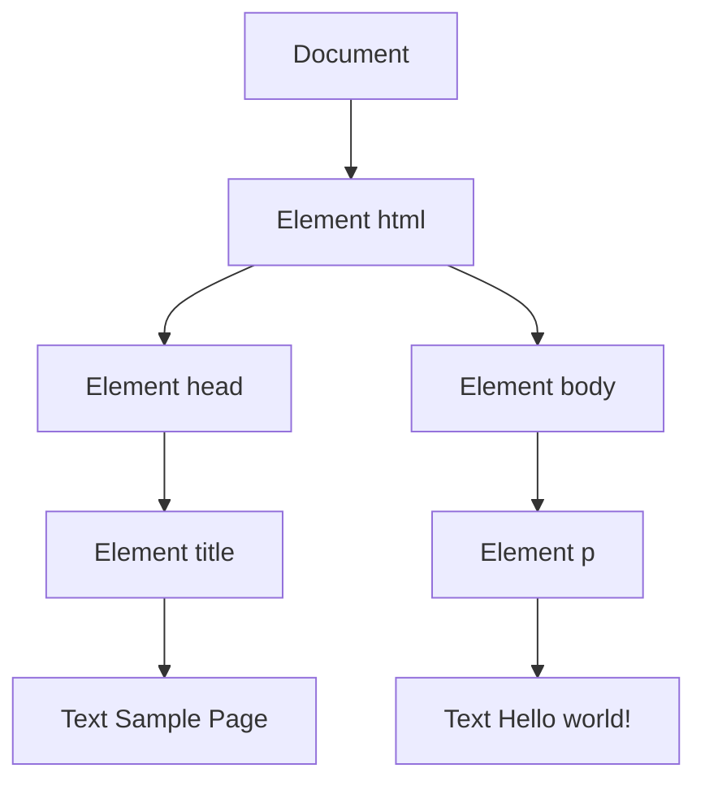

# DOM

文档对象模型(DOM，Document Object Model)是 HTML 和 XML 文档的编程接口。DOM 表示由多层节点构成的文档，通过它开发者可以添加、删除和修改页面的各个部分。脱胎于网景和微软早期的动态 HTML(DHTML，Dynamic HTML)，DOM 现在是真正跨平台、语言无关的表示和操作网页的方式。

DOM Level 1 在 1998 年成为 W3C 推荐标准，提供了基本文档结构和查询的接口。

:::note
IE8 及更低版本中的 DOM 是通过 COM 对象实现的。这意味着这些版本的 IE 中， DOM 对象跟原生 JavaScript 对象具有不同的行为和功能。
:::

## 节点层级

任何 HTML 或 XML 文档都可以用 DOM 表示为一个由节点构成的层级结构。节点分很多类型，每种类型对应着文档中不同的信息和(或)标记，也都有自己不同的特性、数据和方法，而且与其他类型有某种关系。这些关系构成了层级，让标记可以表示为一个以特定节点为根的树形结构。

```html
<html>
  <head>
    <title>Sample Page</title>
  </head>
  <body>
    <p>Hello World!</p>
  </body>
</html>
```



其中，`document` 节点表示每个文档的根节点。在这里，根节点的唯一子节点是 `<html>` 元素，我们称之 为文档元素(documentElement)。文档元素是文档最外层的元素，所有其他元素都存在于这个元素之内。每个文档只能有一个文档元素。在 HTML 页面中，文档元素始终是 `<html>` 元素。在 XML 文档中，则没有这样预定义的元素，任何元素都可能成为文档元素。

HTML 中的每段标记都可以表示为这个树形结构中的一个节点。元素节点表示 HTML 元素，属性节点表示属性，文档类型节点表示文档类型，注释节点表示注释。DOM 中总共有 12 种节点类型，这些类型都继承一种基本类型。

### Node 类型

DOM Level 1 描述了名为 Node 的接口，这个接口是所有 DOM 节点类型都必须实现的。Node 接口在 JavaScript 中被实现为 Node 类型，浏览器可以直接访问这个类型。在 JavaScript 中，所有节点类型都继承 Node 类型，因此所有类型都共享相同的基本属性和方法。

每个节点都有 `nodeType` 属性，表示该节点的类型。节点类型由定义在 Node 类型上的 12 个数值 常量表示:

 Node.ELEMENT_NODE(1)
 Node.ATTRIBUTE_NODE(2)
 Node.TEXT_NODE(3)
 Node.CDATA_SECTION_NODE(4)

### Document 类型

### Element 类型

### Text 类型

### Comment 类型

### CDATASection 类型

### DocumentType 类型

### DocumentFragement 类型

### Dttr 类型

## DOM 编程

## MutationObserver接口
