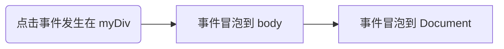
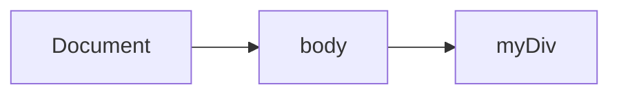
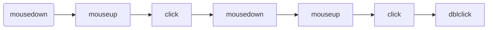

# 事件

JavaScript 与 HTML 的交互是通过事件实现的，事件代表文档或浏览器窗口中某个有意义的时刻。 可以使用仅在事件发生时执行的监听器(也叫处理程序)订阅事件。在传统软件工程领域，这个模型叫 “观察者模式”，其能够做到页面行为(在 JavaScript 中定义)与页面展示(在 HTML 和 CSS 中定义)的分离。

事件最早是在 IE3 和 Netscape Navigator 2 中出现的，当时的用意是把某些表单处理工作从服务器转

移到浏览器上来。到了 IE4 和 Netscape Navigator 3 发布的时候，这两家浏览器都提供了类似但又不同的 API，而且持续了好几代。DOM2 开始尝试以符合逻辑的方式来标准化 DOM 事件 API。目前所有现代浏览器都实现了 DOM2 Events 的核心部分。IE8 是最后一个使用专有事件系统的主流浏览器。

浏览器的事件系统非常复杂。即使所有主流浏览器都实现了 DOM2 Events，规范也没有涵盖所有的事件类型。BOM 也支持事件，这些事件与 DOM 事件之间的关系由于长期以来缺乏文档，经常容易被混淆(HTML5 已经致力于明确这些关系)。而 DOM3 新增的事件 API 又让这些问题进一步复杂化了。 根据具体的需求不同，使用事件可能会相对简单，也可能会非常复杂。但无论如何，理解其中的核心概念还是最重要的。

## 事件流

在第四代 Web 浏览器(IE4 和 Netscape Communicator 4)开始开发时，开发团队碰到了一个有意思的问题:页面哪个部分拥有特定的事件呢?要理解这个问题，可以在一张纸上画几个同心圆。把手指放到圆心上，则手指不仅是在一个圆圈里，而且是在所有的圆圈里。两家浏览器的开发团队都是以同样的方式看待浏览器事件的。当你点击一个按钮时，实际上不光点击了这个按钮，还点击了它的容器以及整个页面。

事件流描述了页面接收事件的顺序。结果非常有意思，IE 和 Netscape 开发团队提出了几乎完全相反的事件流方案。IE 将支持事件冒泡流，而 Netscape Communicator 将支持事件捕获流。

### 事件冒泡

当一个元素上的事件被触发时，这个事件会首先被该元素处理，然后事件会逐步向上传递给它的父元素，再传递给祖父元素，直到文档的根元素 (document 或 window)。这种从最具体的目标元素逐步向上传播的事件流被称为冒泡（Bubbling）。

```html title="HTML结构"
<!doctype html>
<html>
  <head>
    <title>Event Bubbling Example</title>
  </head>
  <body>
    <div id="myDiv">Click Me</div>
  </body>
</html>
```



所有现代浏览器都支持事件冒泡，只是在实现方式上会有一些变化。IE5.5 及早期版本会跳过 `<html>` 元素(从`<body>`直接到 `document`)。现代浏览器中的事件会一直冒泡到 `window` 对象。

### 事件捕获

在事件捕获（Event Capturing）过程中，事件的处理顺序与冒泡相反。事件首先从文档的根节点（或最外层的父元素）开始，然后逐级向下传播，直到到达最具体的目标元素。



在 JavaScript 中，可以通过设置事件监听器的第三个参数为 true，来使用事件捕获：

```js
document.getElementById('myDiv').addEventListener(
  'click',
  function () {
    console.log('myDiv Clicked');
  },
  true,
);
```

### DOM 事件流

DOM2 Events 规范规定事件流分为 3 个阶段:事件捕获、到达目标和事件冒泡。事件捕获最先发生， 为提前拦截事件提供了可能。然后，实际的目标元素接收到事件。最后一个阶段是冒泡，最迟要在这个阶段响应事件。仍以前面那个简单的 HTML 为例，点击 myDiv 元素会以如下所示的顺序触发事件。


在 DOM 事件流中，实际的目标(`<div>`元素)在捕获阶段不会接收到事件。这是因为捕获阶段从 document 到`<html>`再到`<body>`就结束了。下一阶段，即会在`<div>`元素上触发事件的“到达目标” 阶段，通常在事件处理时被认为是冒泡阶段的一部分(稍后讨论)。然后，冒泡阶段开始，事件反向传播至文档。

大多数支持 DOM 事件流的浏览器实现了一个小小的拓展。虽然 DOM2 Events 规范明确捕获阶段不命中事件目标，但现代浏览器都会在捕获阶段在事件目标上触发事件。最终结果是在事件目标上有两个机会来处理事件。

## 事件处理程序

事件意味着用户或浏览器执行的某种动作。比如，单击(click)、加载(load)、鼠标悬停 (mouseover)。为响应事件而调用的函数被称为事件处理程序(或事件监听器)。事件处理程序的名字以"on"开头，因此 click 事件的处理程序叫作 onclick，而 load 事件的处理程序叫作 onload。有很多方式可以指定事件处理程序。

### HTML 事件处理程序

HTML 事件处理程序是用来响应用户操作（如点击、键盘输入、鼠标移动等）并执行相应代码的机制。在 HTML 中，有多种方式可以为元素绑定事件处理程序。下面是几种常见的方式：

在 HTML 标签中直接使用事件属性，比如 onclick、onmouseover、onchange 等。

```html title="内联事件处理程序"
<button onclick="alert('Button clicked!')">Click Me</button>
```

在 HTML 中指定事件处理程序有一些问题。第一个问题是时机问题。有可能 HTML 元素已经显示在页面上，用户都与其交互了，而事件处理程序的代码还无法执行。

如果绑定函数是在页面后面，在按钮中代码的后面定义的，那么当用户在函数被定义之前点击按钮时，就会发生错误。为此，大多数 HTML 事件处理程序会封装在 try/catch 块中， 以便在这种情况下静默失败，如下面的例子所示:

```html
<input
  type="button"
  value="Click Me"
  onclick="try{testFunction();}catch(ex) {}"
/>

<script !src="">
  function testFunction() {
    console.log('Click Me');
  }
</script>
```

### DOM0 事件处理程序

在 JavaScript 中指定事件处理程序的传统方式是把一个函数赋值给(DOM 元素的)一个事件处理程序属性。这也是在第四代 Web 浏览器中开始支持的事件处理程序赋值方法，直到现在所有现代浏览器仍然都支持此方法，主要原因是简单。要使用 JavaScript 指定事件处理程序，必须先取得要操作对象的引用。

```html title="使用 JavaScript 设置事件处理程序"
<button id="myButton">Click Me</button>

<script>
  var button = document.getElementById('myButton');
  button.onclick = function () {
    alert('Button clicked!');
  };
</script>
```

通过将事件处理程序属性的值设置为 null，可以移除通过 DOM0 方式添加的事件处理程序，如下所示:

```js title="移除事件处理程序"
button.onclick = null;
```

:::info
如果事件处理程序是在 HTML 中指定的，则 onclick 属性的值是一个包装相应 HTML 事件处理程序属性值的函数。这些事件处理程序也可以通过在 JavaScript 中将相应属性设置为 null 来移除。
:::

### DOM2 事件处理程序

DOM2 Events 为事件处理程序的赋值和移除定义了两个方法: `addEventListener()` 和 `removeEventListener()`。这两个方法暴露在所有 DOM 节点上，它们接收 3 个参数:事件名、事件处理函数和一个布尔值，true 表示在捕获阶段调用事件处理程序，false(默认值)表示在冒泡阶段调用事件处理程序。

```html title="使用 addEventListener 方法"
<button id="myButton">Click Me</button>

<script>
  var button = document.getElementById('myButton');
  button.addEventListener('click', function () {
    alert('Button clicked!');
  });

  button.addEventListener('click', function () {
    console.log('Another event handler for the same click event.');
  });
</script>
```

```html title="移除事件处理程序
<button id="myButton">Click Me</button>

<script>
  function clickHandler() {
    alert('Button clicked!');
  }

  var button = document.getElementById('myButton');
  button.addEventListener('click', clickHandler);

  // To remove the event listener
  button.removeEventListener('click', clickHandler);
</script>
```

通过 `addEventListener()` 添加的事件处理程序只能使用 `removeEventListener()` 并传入与添加时同样的参数来移除。这意味着使用 `addEventListener()` 添加的匿名函数无法移除。

### IE 事件处理程序

IE 实现了与 DOM 类似的方法，即 `attachEvent()` 和 `detachEvent()`。这两个方法接收两个同样的参数:事件处理程序的名字和事件处理函数。因为 IE8 及更早版本只支持事件冒泡，所以使用 `attachEvent()` 添加的事件处理程序会添加到冒泡阶段。

:::info
随着 IE 的退役，开发者可以更专注于使用现代浏览器支持的标准化技术和 API，如 addEventListener、removeEventListener、Promise、fetch 等，而无需为老旧的浏览器兼容性担忧。
:::

## 事件对象

在 DOM 中发生事件时，所有相关信息都会被收集并存储在一个名为 event 的对象中。这个对象包含了一些基本信息，比如导致事件的元素、发生的事件类型，以及可能与特定事件相关的任何其他数据。 例如，鼠标操作导致的事件会生成鼠标位置信息，而键盘操作导致的事件会生成与被按下的键有关的信息。所有浏览器都支持这个 event 对象，尽管支持方式不同。

在 DOM 合规的浏览器中，event 对象是传给事件处理程序的唯一参数。不管以哪种方式(DOM0 或 DOM2)指定事件处理程序，都会传入这个 event 对象。下面的例子展示了在两种方式下都可以使用事件对象:

```js title="示例"
let btn = document.getElementById('myBtn');
btn.onclick = function (event) {
  console.log(event.type); // "click"
};
btn.addEventListener(
  'click',
  event => {
    console.log(event.type); // "click"
  },
  false,
);
```

所有事件对象都会包含下表列出的这些公共属性和方法。

| 属性/方法                    | 描述                                                                              | 用法                               |
| ---------------------------- | --------------------------------------------------------------------------------- | ---------------------------------- |
| `type`                       | 事件的类型，例如 `"click"`、`"keydown"` 等。                                      | `event.type`                       |
| `target`                     | 触发事件的 DOM 元素。                                                             | `event.target`                     |
| `currentTarget`              | 当前正在处理事件的元素。                                                          | `event.currentTarget`              |
| `preventDefault()`           | 阻止事件的默认行为。                                                              | `event.preventDefault()`           |
| `stopPropagation()`          | 阻止事件在 DOM 树中的传播。                                                       | `event.stopPropagation()`          |
| `stopImmediatePropagation()` | 阻止事件传播并阻止其他事件处理程序被调用。                                        | `event.stopImmediatePropagation()` |
| `bubbles`                    | 布尔值，表示事件是否冒泡。                                                        | `event.bubbles`                    |
| `cancelable`                 | 布尔值，表示事件是否可以取消其默认行为。                                          | `event.cancelable`                 |
| `timestamp`                  | 事件生成的时间戳。                                                                | `event.timestamp`                  |
| `defaultPrevented`           | 布尔值，表示是否调用过 `preventDefault()` 方法。                                  | `event.defaultPrevented`           |
| `view`                       | AbstractView，表示与事件相关的抽象视图。等于事件所发生的 window 对象。            | `event.view`                       |
| `eventPhase`                 | 整数，表示调用事件处理程序的阶段:1 代表捕获阶段，2 代表到达目标，3 代表冒泡阶段。 | `event.eventPhase`                 |

在事件处理程序内部，this 对象始终等于 currentTarget 的值，而 target 只包含事件的实际目标。如果事件处理程序直接添加在了意图的目标，则 this、currentTarget 和 target 的值是一样的。下面的例子展示了这两个属性都等于 this 的情形:

```js
let btn = document.getElementById('myBtn');
btn.onclick = function (event) {
  console.log(event.currentTarget === this); // true
  console.log(event.target === this); // true
};
```

## 事件类型

Web 浏览器中可以发生很多种事件。如前所述，所发生事件的类型决定了事件对象中会保存什么信息。DOM3 Events 定义了如下事件类型。

- [ ] **用户界面事件(UIEvent)**\_:涉及与 BOM 交互的通用浏览器事件。
- [ ] **焦点事件(FocusEvent)**:在元素获得和失去焦点时触发。
- [ ] **鼠标事件(MouseEvent)**:使用鼠标在页面上执行某些操作时触发。
- [ ] **滚轮事件(WheelEvent)**:使用鼠标滚轮(或类似设备)时触发。
- [ ] **输入事件(InputEvent)**:向文档中输入文本时触发。
- [ ] **键盘事件(KeyboardEvent)**:使用键盘在页面上执行某些操作时触发。
- [ ] **合成事件(CompositionEvent)**:在使用某种 IME(Input Method Editor，输入法编辑器)输入字符时触发。

除了这些事件类型之外，HTML5 还定义了另一组事件，而浏览器通常在 DOM 和 BOM 上实现专有事件。这些专有事件基本上都是根据开发者需求而不是按照规范增加的，因此不同浏览器的实现可能不同。

DOM3 Events 在 DOM2 Events 基础上重新定义了事件，并增加了新的事件类型。所有主流浏览器都支持 DOM2 Events 和 DOM3 Events。

### 用户界面事件

UI 事件是与用户界面（User Interface）相关的事件，尽管它们不一定直接与用户操作有关。这些事件大多在 HTML 文档的生命周期中发生，如页面加载、卸载、错误处理等。

#### load

load 事件可能是 JavaScript 中最常用的事件。在 window 对象上，load 事件会在整个页面(包括所有外部资源如图片、JavaScript 文件和 CSS 文件)加载完成后触发。可以通过两种方式指定 load 事件处理程序。

```js title="第一种是 JavaScript 方式"
window.addEventListener('load', event => {
  console.log('Loaded!');
});
```

```html title="第二种指定 load 事件处理程序的方式是向<body>元素添加 onload 属性"
<!doctype html>
<html>
  <head>
    <title>Load Event Example</title>
  </head>
</html>
<body onload="console.log('Loaded!')">
</body>
</html>
```

:::warning
一般来说，任何在 window 上发生的事件，都可以通过给 `<body>` 元素上对应的属性赋值来指定， 这是因为 HTML 中没有 window 元素。这实际上是为了保证向后兼容的一个策略，但在所有浏览器中都能得到很好的支持。实际开发中要尽量使用 JavaScript 方式。
:::

#### unload

与 load 事件相对的是 unload 事件，unload 事件会在文档卸载完成后触发。unload 事件一般是在从一个页面导航到另一个页面时触发，最常用于清理引用，以避免内存泄漏。

```js
window.addEventListener('unload', event => {
  console.log('Unloaded!');
});
```

#### resize

当浏览器窗口被缩放到新高度或宽度时，会触发 resize 事件。这个事件在 window 上触发，因此可以通过 JavaScript 在 window 上或者为 `<body>` 元素添加 onresize 属性来指定事件处理程序。

```js
window.addEventListener('resize', event => {
  console.log('Resized');
});
```

:::info
浏览器窗口在最大化和最小化时也会触发 resize 事件。
:::

#### scroll

当用户滚动包含滚动条的元素时在元素上触发。`<body>` 元素包含已加载页面的滚动条。 大多数 HTML 事件与 window 对象和表单控件有关。

虽然 scroll 事件发生在 window 上，但实际上反映的是页面中相应元素的变化。在混杂模式下， 可以通过 `<body>` 元素检测 `scrollLeft` 和 `scrollTop` 属性的变化。而在标准模式下，这些变化在除早期版的 Safari 之外的所有浏览器中都发生在 `<html>` 元素上(早期版的 Safari 在 `<body>` 上跟踪滚动位置)。下面的代码演示了如何处理这些差异:

```js
window.addEventListener('scroll', event => {
  if (document.compatMode == 'CSS1Compat') {
    console.log(document.documentElement.scrollTop);
  } else {
    console.log(document.body.scrollTop);
  }
});
```

#### abort

在 `<object>` 元素上当相应对象加载完成前被用户提前终止下载时触发。

#### error

在 window 上当 JavaScript 报错时触发，在 `` 元素上当无法加载指定图片时触发， 在 `<object>` 元素上当无法加载相应对象时触发，在窗套上当一个或多个窗格无法完成加载时触发。

#### select

在文本框(`<input>`或 `textarea`)上当用户选择了一个或多个字符时触发。

### 焦点事件

焦点事件在页面元素获得或失去焦点时触发。这些事件可以与 `document.hasFocus()` 和 `document.activeElement` 一起为开发者提供用户在页面中导航的信息。焦点事件有以下4种。

- [ ] **blur**:当元素失去焦点时触发。这个事件不冒泡，所有浏览器都支持。
- [ ] **focus**:当元素获得焦点时触发。这个事件不冒泡，所有浏览器都支持。
- [ ] **focusin**:当元素获得焦点时触发。这个事件是 focus 的冒泡版。
- [ ] **focusout**:当元素失去焦点时触发。这个事件是 blur 的通用版。

焦点事件中的两个主要事件是 focus 和 blur，这两个事件在 JavaScript 早期就得到了浏览器支持。它们最大的问题是不冒泡。这导致 IE 后来又增加了 focusin 和 focusout，Opera 又增加了 DOMFocusIn 和 DOMFocusOut (已经废除)。IE 新增的这两个事件已经被 DOM3 Events 标准化。

### 鼠标和滚轮事件

鼠标事件是 Web 开发中最常用的一组事件，这是因为鼠标是用户的主要定位设备。DOM3 Events 定义了 9 种鼠标事件。

1. `click`: 当用户点击鼠标时触发。
2. `dblclick`: 当用户双击鼠标时触发。
3. `mousedown`: 当用户按下鼠标按钮时触发。
4. `mouseup`: 当用户释放鼠标按钮时触发。
5. `mouseover`: 当鼠标指针移动到一个元素上方时触发。
6. `mousemove`: 当鼠标指针在元素上移动时触发。
7. `mouseout`: 当鼠标指针离开一个元素时触发。
8. `mouseenter`: 当鼠标指针进入一个元素时触发（不会在子元素上重复触发）。
9. `mouseleave`: 当鼠标指针离开一个元素时触发（不会在子元素上重复触发）。

页面中的所有元素都支持鼠标事件。除了 mouseenter 和 mouseleave，所有鼠标事件都会冒泡，都可以被取消，而这会影响浏览器的默认行为。

由于事件之间存在关系，因此取消鼠标事件的默认行为也会影响其他事件。

比如，click 事件触发的前提是 mousedown 事件触发后，紧接着又在同一个元素上触发了 mouseup 事件。如果 mousedown 和 mouseup 中的任意一个事件被取消，那么 click 事件就不会触发。类似地，两次连续的 click 事件会导致 dblclick 事件触发。只要有任何逻辑阻止了这两个 click 事件发生(比如取消其中一个 click 事件或者取消 mousedown 或 mouseup 事件中的任一个)，dblclick 事件就不会发生。这 4 个事件永远会按照如下顺序触发:



click 和 dblclick 在触发前都依赖其他事件触发，mousedown 和 mouseup 则不会受其他事件影响。

:::info
鼠标事件在 DOM3 Events 中对应的类型是"MouseEvent"，而不是"MouseEvents"。
:::

#### 客户端坐标

鼠标事件都是在浏览器视口中的某个位置上发生的。这些信息被保存在event对象的 `clientX` 和 `clientY` 属性中。这两个属性表示事件发生时鼠标光标在视口中的坐标，所有浏览器都支持。

```js title="获取鼠标事件的客户端坐标"
let div = document.getElementById('myDiv');
div.addEventListener('click', event => {
  console.log(`Client coordinates: ${event.clientX}, ${event.clientY}`);
});
```

#### 页面坐标

客户端坐标是事件发生时鼠标光标在客户端视口中的坐标，而页面坐标是事件发生时鼠标光标在页面上的坐标，通过 event 对象的 `pageX` 和 `pageY` 可以获取。这两个属性表示鼠标光标在页面上的位置，因此反映的是光标到页面而非视口左边与上边的距离。

```js
let div = document.getElementById('myDiv');
div.addEventListener('click', event => {
  console.log(`Page coordinates: ${event.pageX}, ${event.pageY}`);
});
```

在页面没有滚动时，`pageX` 和 `pageY` 与 `clientX` 和 `clientY` 的值相同。

#### 屏幕坐标

鼠标事件不仅是在浏览器窗口中发生的，也是在整个屏幕上发生的。可以通过 event 对象的 `screenX` 和 `screenY` 属性获取鼠标光标在屏幕上的坐标。

```js
let div = document.getElementById('myDiv');
div.addEventListener('click', event => {
  console.log(`Screen coordinates: ${event.screenX}, ${event.screenY}`);
});
```

#### 修饰键

虽然鼠标事件主要是通过鼠标触发的，但有时候要确定用户想实现的操作，还要考虑键盘按键的状态。键盘上的修饰键 Shift、Ctrl、Alt 和 Meta 经常用于修改鼠标事件的行为。DOM 规定了 4 个属性来表示这几个修饰键的状态: `shiftKey`、`ctrlKey`、`altKey` 和 `metaKey`。这几属性会在各自对应的修饰键被按下时包含布尔值 true，没有被按下时包含 false。在鼠标事件发生的，可以通过这几个属性来检测修饰键是否被按下。来看下面的例子，其中在 click 事件发生时检测了每个修饰键的状态:

```js
let div = document.getElementById('myDiv');
div.addEventListener('click', event => {
  let keys = new Array();
  if (event.shiftKey) {
    keys.push('shift');
  }
  if (event.ctrlKey) {
    keys.push('ctrl');
  }
  if (event.altKey) {
    keys.push('alt');
  }
  if (event.metaKey) {
    keys.push('meta');
  }
  console.log('Keys: ' + keys.join(','));
});
```

#### 鼠标按键

只有在元素上单击鼠标主键(或按下键盘上的回车键)时 click 事件才会触发，因此按键信息并不是必需的。对 mousedown 和 mouseup 事件来说，event 对象上会有一个 button 属性，表示按下或释放的是哪个按键。DOM 为这个 button 属性定义了 3 个值:0 表示鼠标主键、1 表示鼠标中键(通常也是滚轮键)、2 表示鼠标副键。按照惯例，鼠标主键通常是左边的按键，副键通常是右边的按键。

#### 额外事件信息

DOM2 Events 规范在 event 对象上提供了 detail 属性，以给出关于事件的更多信息。对鼠标事件来说，detail 包含一个数值，表示在给定位置上发生了多少次单击。单击相当于在同一个像素上发生一次 mousedown 紧跟一次 mouseup。detail 的值从 1 开始，每次单击会加 1。如果鼠标在 mousedown 和 mouseup 之间移动了，则 detail 会重置为 0。

### 键盘与输入事件

在 Web 开发中，键盘和输入事件是用于处理用户在键盘上的交互操作的关键部分。它们包括用户按下、释放键以及在输入字段中输入内容的事件。这些事件通常用于增强用户界面的交互性，比如捕获快捷键、验证表单输入、提供自动补全功能等。

#### 常见的键盘事件

1. `keydown` 在用户按下键盘上的任意键时触发，持续触发直到按键被松开。它在按键被按下时首先被触发。可以检测所有按键，包括控制键（如 Shift、Ctrl、Alt）。支持捕获组合键。

```js
document.addEventListener('keydown', event => {
  console.log('Key down:', event.key);
});
```

2. `keyup` 在用户松开键盘上的键时触发。它在 keydown 事件之后触发。同样适用于所有按键。

```js
document.addEventListener('keyup', event => {
  console.log('Key up:', event.key);
});
```

#### 输入事件

1. `input` 在 `<input>`、`<textarea>` 或者 contenteditable 元素的值发生变化时触发。适用于所有输入方式，包括鼠标粘贴、拖放和输入法。

```js
const inputElement = document.querySelector('input');
inputElement.addEventListener('input', event => {
  console.log('Input event:', event.target.value);
});
```

2. `change` 在输入元素的值改变并且元素失去焦点（blur）时触发。对于 `<input>` 和 `<textarea>` 元素，它只在值实际发生改变并且焦点移开时触发。通常用于表单的提交或验证。

```js
const inputElement = document.querySelector('input');
inputElement.addEventListener('change', event => {
  console.log('Change event:', event.target.value);
});
```

3. `focus` 和 `blur`: 当输入元素获得/失去焦点时触发

```js
const inputElement = document.querySelector('input');
inputElement.addEventListener('focus', () => {
  console.log('Input focused');
});

inputElement.addEventListener('blur', () => {
  console.log('Input lost focus');
});
```

#### 常用键盘事件属性

- `key`: 表示按下的键的值，如 "a"、"Enter"、"ArrowDown" 等。
- `code`: 表示按键的物理位置的代码，如 "KeyA"、"Enter"、"ArrowDown"。
- `keyCode`: 表示按键的 Unicode 编码，已被 event.key 取代，不推荐使用。
- `ctrlKey`: 表示 Ctrl 键是否被按下（布尔值）。
- `shiftKey`: 表示 Shift 键是否被按下（布尔值）。
- `altKey`: 表示 Alt 键是否被按下（布尔值）。
- `metaKey`: 表示 Meta 键（在 Mac 上为 Command 键）是否被按下（布尔值）。

#### 组合键处理

你可以检测组合键（如 Ctrl+C、Ctrl+V 等），通过检查 event.ctrlKey、event.shiftKey、event.altKey 和 event.metaKey 来实现。

```js
document.addEventListener('keydown', event => {
  if (event.ctrlKey && event.key === 'c') {
    console.log('Ctrl+C pressed');
  }
});
```

:::warning 事件监听的注意事项

使用 addEventListener 添加事件监听器，以确保事件不会被意外覆盖。及时移除不再需要的事件监听器，以避免内存泄漏。使用 `event.preventDefault()` 可以阻止某些默认行为（如阻止表单提交、取消按键默认功能等）。
:::

### 合成事件

合成事件是 DOM3 Events 中新增的，用于处理通常使用 IME 输入时的复杂输入序列。IME 可以让用户输入物理键盘上没有的字符。例如，使用拉丁字母键盘的用户还可以使用 IME 输入日文。IME 通常需要同时按下多个键才能输入一个字符。合成事件用于检测和控制这种输入。合成事件有以下 3 种:

- [ ] `compositionstart`，在 IME 的文本合成系统打开时触发，表示输入即将开始;
- [ ] `compositionupdate`，在新字符插入输入字段时触发;
- [ ] `compositionend`，在 IME 的文本合成系统关闭时触发，表示恢复正常键盘输入。

合成事件在很多方面与输入事件很类似。在合成事件触发时，事件目标是接收文本的输入字段。唯一增加的事件属性是 data，其中包含的值视情况而异:

与文本事件类似，合成事件可以用来在必要时过滤输入内容。可以像下面这样使用合成事件:

```js
let textbox = document.getElementById('myText');
textbox.addEventListener('compositionstart', event => {
  console.log(event.data);
});
textbox.addEventListener('compositionupdate', event => {
  console.log(event.data);
});
textbox.addEventListener('compositionend', event => {
  console.log(event.data);
});
```

### HTML5 事件

#### contextmenu 事件

Windows 95 通过单击鼠标右键为 PC 用户增加了上下文菜单的概念。不久，这个概念也在 Web 上得以实现。开发者面临的问题是如何确定何时该显示上下文菜单(在 Windows 上是右击鼠标，在 Mac 上是 Ctrl+单击)，以及如何避免默认的上下文菜单起作用。结果就出现了 `contextmenu` 事件，以专门用于表示何时该显示上下文菜单，从而允许开发者取消默认的上下文菜单并提供自定义菜单。

这个事件在所有浏览器中都可以取消，在 DOM 合规的浏览器中使用 `event.preventDefault()`。

#### beforeunload 事件

`beforeunload` 事件会在 window 上触发，用意是给开发者提供阻止页面被卸载的机会。这个事件会在页面即将从浏览器中卸载时触发，如果页面需要继续使用，则可以不被卸载。这个事件不能取消，否则就意味着可以把用户永久阻拦在一个页面上。相反，这个事件会向用户显示一个确认框，其中的消息表明浏览器即将卸载页面，并请用户确认是希望关闭页面，还是继续留在页面上。

以下是触发和处理 `beforeunload` 事件的基本方法：

```js
window.addEventListener('beforeunload', event => {
  // 自定义消息
  const message = '您确定要离开此页面吗？未保存的更改将会丢失。';

  // 现代浏览器会忽略自定义消息，但仍需设置 event.returnValue
  event.returnValue = message;

  // 返回值决定是否显示确认对话框
  return message;
});
```

:::warning 触发条件
`beforeunload` 事件需要用户进行某种交互（如点击、输入等）后才生效, 这主要是出于以下几个原因：防止恶意行为、节约资源、安全性。
:::

#### DOMContentLoaded 事件

window 的 `load` 事件会在页面完全加载后触发，因为要等待很多外部资源加载完成，所以会花费较长时间。而 `DOMContentLoaded` 事件会在 DOM 树构建完成后立即触发，而不用等待图片、JavaScript 文件、CSS 文件或其他资源加载完成。相对于 load 事件，DOMContentLoaded 可以让开发者在外部资 18 源下载的同时就能指定事件处理程序，从而让用户能够更快地与页面交互。

要处理 DOMContentLoaded 事件，需要给 document 或 window 添加事件处理程序(实际的事件目标是 document，但会冒泡到 window)。下面是一个在 document 上监听 DOMContentLoaded 事件的例子:

```js
document.addEventListener('DOMContentLoaded', event => {
  console.log('DOMContentLoaded');
});
```

`DOMContentLoaded` 事件通常用于添加事件处理程序或执行其他 DOM 操作。这个事件始终在 `load` 事件之前触发。

#### readystatechange 事件

`readystatechange` 事件是与文档的加载状态有关的一个事件。它会在文档的加载状态（readyState）改变时触发，通常用于检测文档加载的不同阶段。readyState 属性表示当前文档的加载状态，常用于判断页面加载过程中的关键时刻，比如 DOM 是否已完全加载。

`readyState` 属性的可能值:

document.readyState 属性可以有以下几种状态：

1. `loading`: 文档正在加载。文档还没有完全被解析，加载仍在进行中。
2. `interactive`: 文档已被解析，但资源（如图片、样式表等）还在加载。此时可以开始访问 DOM 节点，但资源可能尚未完全加载完毕。
3. `complete`: 文档及其所有资源（如图片、样式表、子框架等）已经完全加载并解析完毕。

```js title="监听 readystatechange 事件"
document.addEventListener('readystatechange', () => {
  if (document.readyState === 'loading') {
    console.log('Document is loading...');
  } else if (document.readyState === 'interactive') {
    console.log('Document is interactive, but not fully loaded yet.');
  } else if (document.readyState === 'complete') {
    console.log('Document is fully loaded.');
  }
});
```

#### pageshow 与 pagehide 事件

`pageshow` 和 `pagehide` 事件是与页面的导航状态和生命周期有关的事件。这些事件主要用于处理页面在浏览器历史导航（如前进、后退）中的行为，通常与单页应用（SPA）或缓存机制（如 bfcache，浏览器前进后退缓存）相关。

**pageshow 事件**

`pageshow` 事件在页面被显示时触发。页面可能是首次加载时被显示，也可能是通过浏览器的前进或后退按钮从缓存中恢复时显示。

1. 首次加载：当页面首次被加载时，pageshow 事件会触发。
2. 从缓存中恢复：当页面通过浏览器的前进或后退按钮从缓存中恢复时，pageshow 事件也会触发。
3. persisted 属性：event.persisted 属性是 true，表示页面是从缓存中恢复的。

```js
window.addEventListener('pageshow', event => {
  if (event.persisted) {
    console.log('Page was restored from the cache.');
  } else {
    console.log('Page was loaded normally.');
  }
});
```

**pagehide 事件**

`pagehide` 事件在页面被隐藏时触发。页面可能是因为用户导航到另一个页面、关闭标签页、或者通过前进或后退按钮离开当前页面而被隐藏。

1. 页面隐藏：pagehide 事件在页面从视图中消失时触发，可能是因为导航到另一个页面，也可能是用户关闭了浏览器标签页。
2. 缓存控制：可以通过 event.persisted 属性检查页面是否会被缓存（如 bfcache）。如果 event.persisted 为 true，页面可能会被缓存供以后使用。

```js
window.addEventListener('pagehide', event => {
  if (event.persisted) {
    console.log('Page is being cached by the browser.');
  } else {
    console.log('Page is being unloaded and not cached.');
  }
});
```

#### hashchange 事件

HTML5 增加了 hashchange 事件，用于在 URL 散列值(URL 最后#后面的部分)发生变化时通知开发者。这是因为开发者经常在 Ajax 应用程序中使用 URL 散列值存储状态信息或路由导航信息。

`onhashchange` 事件处理程序必须添加给 window，每次 URL 散列值发生变化时会调用它。event 对象有两个新属性: `oldURL` 和 `newURL`。这两个属性分别保存变化前后的 URL，而且是包含散列值的完整 URL。下面的例子展示了如何获取变化前后的 URL:

```js
window.addEventListener('hashchange', event => {
  console.log(`Old URL: ${event.oldURL}, New URL: ${event.newURL}`);
});
```

如果想确定当前的散列值，最好使用 location 对象:

```js
window.addEventListener('hashchange', event => {
  console.log(`Current hash: ${location.hash}`);
});
```

### 设备事件

设备事件（Device Events）是指浏览器可以通过设备的硬件传感器（如加速度计、陀螺仪、指南针等）感知到用户设备状态变化时触发的事件。这些事件允许开发者在 Web 应用中响应设备的物理动作，例如设备的旋转、移动或方向变化。

#### deviceorientation 事件

当设备的物理方向改变时触发。该事件提供了设备的旋转角度数据，包括围绕设备的三个轴（alpha、beta 和 gamma）的旋转信息。适用于实现基于设备方向的应用，如虚拟现实、增强现实、游戏等。

1. alpha: 设备绕Z轴旋转的角度（0°到360°），即指南针方向。
2. beta: 设备绕X轴的旋转角度（-180°到180°），表示设备的前后倾斜。
3. gamma: 设备绕Y轴的旋转角度（-90°到90°），表示设备的左右倾斜。

```js
window.addEventListener('deviceorientation', event => {
  console.log(`Alpha: ${event.alpha}`);
  console.log(`Beta: ${event.beta}`);
  console.log(`Gamma: ${event.gamma}`);
});
```

#### devicemotion 事件

:::warning 安全上下文

此项功能仅在一些支持的浏览器的安全上下文（HTTPS）中可用。
:::

当设备在物理空间中移动时触发。该事件提供了设备的加速度信息，包括由于重力或设备本身的运动引起的加速度变化。用于检测设备的移动，例如步数计、摇动检测等。

1. acceleration: 没有重力影响时的加速度信息。
2. accelerationIncludingGravity: 包括重力影响的加速度信息。
3. rotationRate: 设备的旋转速率，提供了设备绕X、Y、Z轴的旋转速度。
4. interval: 事件触发的时间间隔，以毫秒为单位。

```js
window.addEventListener('devicemotion', event => {
  console.log('Acceleration X: ', event.acceleration.x);
  console.log('Acceleration Y: ', event.acceleration.y);
  console.log('Acceleration Z: ', event.acceleration.z);
  console.log('Rotation Rate Alpha: ', event.rotationRate.alpha);
  console.log('Rotation Rate Beta: ', event.rotationRate.beta);
  console.log('Rotation Rate Gamma: ', event.rotationRate.gamma);
});
```

### 触摸及手势事件

#### 触摸事件

当手指放在屏幕上、在屏幕上滑动或从屏幕移开时，触摸事件即会触发。触摸事件有如下几种。

- [ ] `touchstart`:手指放到屏幕上时触发(即使有一个手指已经放在了屏幕上)。
- [ ] `touchmove`:手指在屏幕上滑动时连续触发。在这个事件中调用 `preventDefault()` 可以阻止滚动。
- [ ] `touchend`:手指从屏幕上移开时触发。
- [ ] `touchcancel`:系统停止跟踪触摸时触发。文档中并未明确什么情况下停止跟踪。

#### 手势事件

iOS 2.0 中的 Safari 还增加了一种手势事件。手势事件会在两个手指触碰屏幕且相对距离或旋转角度变化时触发。手势事件有以下 3 种。

- [ ] `gesturestart`:一个手指已经放在屏幕上，再把另一个手指放到屏幕上时触发。
- [ ] `gesturechange`:任何一个手指在屏幕上的位置发生变化时触发。
- [ ] `gestureend`:其中一个手指离开屏幕时触发。

### 事件参考

| 事件类型     | 事件名称            | 描述                                             |
| ------------ | ------------------- | ------------------------------------------------ |
| **鼠标事件** | `click`             | 用户点击鼠标按钮时触发。                         |
|              | `dblclick`          | 用户双击鼠标按钮时触发。                         |
|              | `mousedown`         | 用户按下鼠标按钮时触发。                         |
|              | `mouseup`           | 用户释放鼠标按钮时触发。                         |
|              | `mousemove`         | 用户移动鼠标时触发。                             |
| **键盘事件** | `keydown`           | 用户按下键盘上的键时触发。                       |
|              | `keyup`             | 用户释放键盘上的键时触发。                       |
|              | `keypress`          | 用户按下并释放键盘上的键时触发（已不推荐使用）。 |
| **触摸事件** | `touchstart`        | 用户用手指接触屏幕时触发。                       |
|              | `touchmove`         | 用户在屏幕上滑动手指时触发。                     |
|              | `touchend`          | 用户从屏幕上移开手指时触发。                     |
|              | `touchcancel`       | 触摸操作被系统中断时触发。                       |
| **滚动事件** | `scroll`            | 元素的滚动条移动时触发。                         |
| **焦点事件** | `focus`             | 元素获得焦点时触发。                             |
|              | `blur`              | 元素失去焦点时触发。                             |
| **表单事件** | `submit`            | 表单提交时触发。                                 |
|              | `change`            | 表单控件的值发生变化时触发。                     |
|              | `input`             | 表单控件的输入值发生变化时触发。                 |
|              | `invalid`           | 表单控件的输入值不符合验证规则时触发。           |
| **媒体事件** | `play`              | 媒体开始播放时触发。                             |
|              | `pause`             | 媒体暂停时触发。                                 |
|              | `ended`             | 媒体播放结束时触发。                             |
|              | `volumechange`      | 媒体音量变化时触发。                             |
| **拖放事件** | `drag`              | 元素拖动时触发。                                 |
|              | `dragstart`         | 拖动开始时触发。                                 |
|              | `dragend`           | 拖动结束时触发。                                 |
|              | `dragover`          | 拖动元素在目标元素上方时触发。                   |
|              | `dragenter`         | 拖动元素进入目标元素时触发。                     |
|              | `dragleave`         | 拖动元素离开目标元素时触发。                     |
|              | `drop`              | 拖动元素释放在目标元素上时触发。                 |
| **设备事件** | `deviceorientation` | 设备方向变化时触发。                             |
|              | `devicemotion`      | 设备运动状态变化时触发。                         |
| **全屏事件** | `fullscreenchange`  | 全屏模式状态改变时触发。                         |
|              | `fullscreenerror`   | 进入全屏模式失败时触发。                         |
| **指针事件** | `pointerdown`       | 指针（鼠标、触摸、笔等）接触屏幕时触发。         |
|              | `pointerup`         | 指针从屏幕上移开时触发。                         |
|              | `pointermove`       | 指针在屏幕上移动时触发。                         |
|              | `pointerenter`      | 指针进入目标元素时触发。                         |
|              | `pointerleave`      | 指针离开目标元素时触发。                         |

## 内存与性能

因为事件处理程序在现代 Web 应用中可以实现交互，所以很多开发者会错误地在页面中大量使用它们。在创建 GUI 的语言如 C#中，通常会给 GUI 上的每个按钮设置一个 onclick 事件处理程序。这样做不会有什么性能损耗。在 JavaScript 中，页面中事件处理程序的数量与页面整体性能直接相关。原因有很多。首先，每个函数都是对象，都占用内存空间，对象越多，性能越差。其次，为指定事件处理程序所需访问 DOM 的次数会先期造成整个页面交互的延迟。只要在使用事件处理程序时多注意一些方法，就可以改善页面性能。

### 事件委托

“过多事件处理程序”的解决方案是使用事件委托。事件委托利用事件冒泡，可以只使用一个事件处理程序来管理一种类型的事件。例如，click 事件冒泡到 document。这意味着可以为整个页面指定一个 onclick 事件处理程序，而不用为每个可点击元素分别指定事件处理程序。比如有以下 HTML:

```html
<ul id="myLinks">
  <li id="goSomewhere">Go somewhere</li>
  <li id="doSomething">Do something</li>
  <li id="sayHi">Say hi</li>
</ul>
```

```js title="错误示范"
// 这就是过多事件处理程序
let item1 = document.getElementById('goSomewhere');
let item2 = document.getElementById('doSomething');
let item3 = document.getElementById('sayHi');
item1.addEventListener('click', event => {
  location.href = 'http:// www.wrox.com';
});
item2.addEventListener('click', event => {
  document.title = "I changed the document's title";
});
item3.addEventListener('click', event => {
  console.log('hi');
});
```

使用事件委托，只要给所有元素共同的祖先节点添加一个事件处理程序，就可以解决问题

```js title="正确示范"
let list = document.getElementById('myLinks');
list.addEventListener('click', event => {
  let target = event.target;
  switch (target.id) {
    case 'doSomething':
      document.title = "I changed the document's title";
      break;
    case 'goSomewhere':
      location.href = 'http:// www.wrox.com';
      break;
    case 'sayHi':
      console.log('hi');
      break;
  }
});
```

### 删除事件处理程序

把事件处理程序指定给元素后，在浏览器代码和负责页面交互的 JavaScript 代码之间就建立了联系。这种联系建立得越多，页面性能就越差。除了通过事件委托来限制这种连接之外，还应该及时删除不用的事件处理程序。很多 Web 应用性能不佳都是由于无用的事件处理程序长驻内存导致的。

导致这个问题的原因主要有两个。第一个是删除带有事件处理程序的元素。比如通过真正的 DOM 方法 `removeChild()` 或 `replaceChild()` 删除节点。最常见的还是使用 innerHTML 整体替换页面的某一部分。这时候，被 innerHTML 删除的元素上如果有事件处理程序，就不会被垃圾收集程序正常清理。比如下面的例子:

```html
<div id="myDiv">
  <input type="button" value="Click Me" id="myBtn" />
</div>
<script type="text/javascript">
  let btn = document.getElementById('myBtn');
  btn.onclick = function () {
    // 执行操作
    document.getElementById('myDiv').innerHTML = 'Processing...';
    // 不好!
  };
</script>
```

删除带有事件处理程序的元素，并不会连带事件删除，如果知道某个元素会被删除，那么最好在删除它之前手工删除它的事件处理程序。

```js
btn.onclick = null;
```

另一个可能导致内存中残留引用的问题是页面卸载。同样，IE8 及更早版本在这种情况下有很多问题，不过好像所有浏览器都会受这个问题影响。如果在页面卸载后事件处理程序没有被清理，则它们仍然会残留在内存中。之后，浏览器每次加载和卸载页面(比如通过前进、后退或刷新)，内存中残留对象的数量都会增加，这是因为事件处理程序不会被回收。

一般来说，最好在 onunload 事件处理程序中趁页面尚未卸载先删除所有事件处理程序。这时候也能体现使用事件委托的优势，因为事件处理程序很少，所以很容易记住要删除哪些。关于卸载页面时的清理，可以记住一点: onload 事件处理程序中做了什么，最好在 onunload 事件处理程序中恢复。

## 模拟事件

事件就是为了表示网页中某个有意义的时刻。通常，事件都是由用户交互或浏览器功能触发。事实上，可能很少有人知道可以通过 JavaScript 在任何时候触发任意事件，而这些事件会被当成浏览器创建的事件。这意味着同样会有事件冒泡，因而也会触发相应的事件处理程序。这种能力在测试 Web 应用时特别有用。DOM3 规范指明了模拟特定类型事件的方式。

### DOM 事件模拟

任何时候，都可以使用 `document.createEvent()` 方法创建一个 event 对象。这个方法接收一个参数，此参数是一个表示要创建事件类型的字符串。在 DOM2 中，所有这些字符串都是英文复数形式，但在 DOM3 中，又把它们改成了英文单数形式。可用的字符串值是以下值之一。

- "UIEvents"(DOM3 中是"UIEvent"):通用用户界面事件(鼠标事件和键盘事件都继承自这个事件)。
- "MouseEvents"(DOM3 中是"MouseEvent"):通用鼠标事件。
- "HTMLEvents"(DOM3 中没有):通用 HTML 事件(HTML 事件已经分散到了其他事件大类中)
