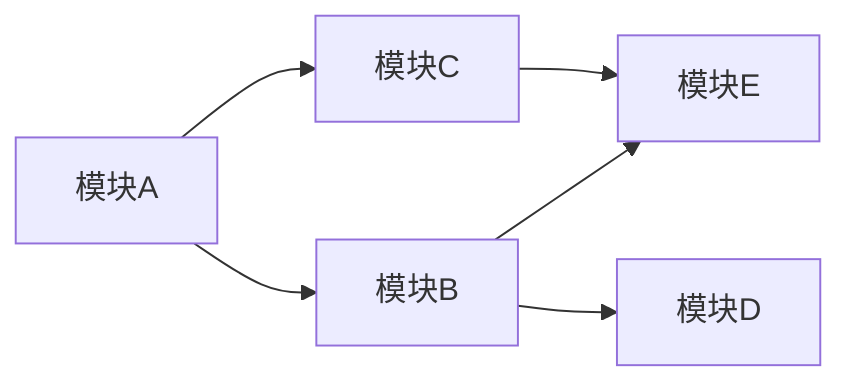

# 模块

现代 JavaScript 开发毋庸置疑会遇到代码量大和广泛使用第三方库的问题。解决这个问题的方案通常需要把代码拆分成很多部分，然后再通过某种方式将它们连接起来。

在 ECMAScript 6 模块规范出现之前，虽然浏览器原生不支持模块的行为，但迫切需要这样的行为。 ECMAScript 同样不支持模块，因此希望使用模块模式的库或代码库必须基于 JavaScript 的语法和词法特性“伪造”出类似模块的行为。

因为 JavaScript 是异步加载的解释型语言，所以得到广泛应用的各种模块实现也表现出不同的形态。 这些不同的形态决定了不同的结果，但最终它们都实现了经典的模块模式。

## 理解模块模式

> 将代码拆分成独立的块，然后再把这些块连接起来可以通过模块模式来实现。这种模式背后的思想很简单:把逻辑分块，各自封装，相互独立，每个块自行决定对外暴露什么，同时自行决定引入执行哪些外部代码。不同的实现和特性让这些基本的概念变得有点复杂，但这个基本的思想是所有 JavaScript 模块系统的基础。

### 模块标识符

模块标识符是所有模块系统通用的概念。模块系统本质上是键/值实体，其中每个模块都有个可用于引用它的标识符。这个标识符在模拟模块的系统中可能是字符串，在原生实现的模块系统中可能是模块文件的实际路径。

有的模块系统支持明确声明模块的标识，还有的模块系统会隐式地使用文件名作为模块标识符。不管怎样，完善的模块系统一定不会存在模块标识冲突的问题，且系统中的任何模块都应该能够无歧义地引用其他模块。

将模块标识符解析为实际模块的过程要根据模块系统对标识符的实现。原生浏览器模块标识符必须提供实际 JavaScript 文件的路径。除了文件路径，Node.js 还会搜索 node_modules 目录，用标识符去匹配包含 index.js 的目录。

### 模块依赖

模块系统的核心是管理依赖。指定依赖的模块与周围的环境会达成一种契约。本地模块向模块系统声明一组外部模块(依赖)，这些外部模块对于当前模块正常运行是必需的。模块系统检视这些依赖， 进而保证这些外部模块能够被加载并在本地模块运行时初始化所有依赖。

每个模块都会与某个唯一的标识符关联，该标识符可用于检索模块。这个标识符通常是 JavaScript 文件的路径，但在某些模块系统中，这个标识符也可以是在模块本身内部声明的命名空间路径字符串。

### 模块加载

加载模块的概念派生自依赖契约。当一个外部模块被指定为依赖时，本地模块期望在执行它时，依 18 赖已准备好并已初始化。

在浏览器中，加载模块涉及几个步骤。加载模块涉及执行其中的代码，但必须是在所有依赖都加载并执行之后。如果浏览器没有收到依赖模块的代码，则必须发送请求并等待网络返回。收到模块代码之 19 后，浏览器必须确定刚收到的模块是否也有依赖。然后递归地评估并加载所有依赖，直到所有依赖模块都加载完成。只有整个依赖图都加载完成，才可以执行入口模块。

### 入口

相互依赖的模块必须指定一个模块作为入口(entry point)，这也是代码执行的起点。这是理所当然的，因为 JavaScript 是顺序执行的，并且是单线程的，所以代码必须有执行的起点。入口模块也可能依赖其他模块，其他模块同样可能有自己的依赖。于是模块化 JavaScript 应用程序的所有模块会构成依赖图。



图中的箭头表示依赖方向:模块 A 依赖模块 B 和模块 C，模块 B 依赖模块 D 和模块 E，模块 C 依赖模块 E。因为模块必须在依赖加载完成后才能被加载，所以这个应用程序的入口模块 A 必须在应用程序的其他部分加载后才能执行。

在 JavaScript 中，“加载”的概念可以有多种实现方式。因为模块是作为包含将立即执行的 JavaScript 代码的文件实现的，所以一种可能是按照依赖图的要求依次请求各个脚本。对于前面的应用程序来说，下面的脚本请求顺序能够满足依赖图的要求:

```html title="模块加载顺序"
<script src="moduleE.js"></script>
<script src="moduleD.js"></script>
<script src="moduleC.js"></script>
<script src="moduleB.js"></script>
<script src="moduleA.js"></script>
```

模块加载是“阻塞的”，这意味着前置操作必须完成才能执行后续操作。每个模块在自己的代码到达浏览器之后完成加载，此时其依赖已经加载并初始化。不过，这个策略存在一些性能和复杂性问题。为一个应用程序而按顺序加载五个 JavaScript 文件并不理想，并且手动管理正确的加载顺序也颇为棘手。

### 异步依赖

因为 JavaScript 可以异步执行，所以如果能按需加载就好了。换句话说，可以让 JavaScript 通知模块系统在必要时加载新模块，并在模块加载完成后提供回调。在代码层面，可以通过下面的伪代码来实现:

```js
// 在模块A里面
load('moduleB').then(function (moduleB) {
  moduleB.doStuff();
});
```

模块 A 的代码使用了 moduleB 标识符向模块系统请求加载模块 B，并以模块 B 作为参数调用回调。 模块 B 可能已加载完成，也可能必须重新请求和初始化，但这里的代码并不关心。这些事情都交给了模块加载器去负责。

如果重写前面的应用程序，只使用动态模块加载，那么使用一个 `<script>` 标签即可完成模块 A 的加载。模块 A 会按需请求模块文件，而不会生成必需的依赖列表。这样有几个好处，其中之一就是性能， 因为在页面加载时只需同步加载一个文件。

这些脚本也可以分离出来，比如给 `<script>` 标签应用 defer 或 async 属性，再加上能够识别异步脚本何时加载和初始化的逻辑。此行为将模拟在 ES6 模块规范中实现的行为，本章稍后会对此进行讨论。

### 动态依赖

有些模块系统要求开发者在模块开始列出所有依赖，而有些模块系统则允许开发者在程序结构中动态添加依赖。动态添加的依赖有别于模块开头列出的常规依赖，这些依赖必须在模块执行前加载完毕。

```js title="动态依赖加载示例"
if (loadCondition) {
  require('./moduleA');
}
```

在这个模块中，是否加载 moduleA 是运行时确定的。加载 moduleA 时可能是阻塞的，也可能导致执行，且只有模块加载后才会继续。无论怎样，模块内部的代码在 moduleA 加载前都不能执行，因为 moduleA 的存在是后续模块行为正确的关键。

动态依赖可以支持更复杂的依赖关系，但代价是增加了对模块进行静态分析的难度。

### 静态分析

模块中包含的发送到浏览器的 JavaScript 代码经常会被静态分析，分析工具会检查代码结构并在不实际执行代码的情况下推断其行为。对静态分析友好的模块系统可以让模块打包系统更容易将代码处理为较少的文件。它还将支持在智能编辑器里智能自动完成。

更复杂的模块行为，例如动态依赖，会导致静态分析更困难。不同的模块系统和模块加载器具有不同层次的复杂度。至于模块的依赖，额外的复杂度会导致相关工具更难预测模块在执行时到底需要哪些依赖。

### 循环依赖

要构建一个没有循环依赖的 JavaScript 应用程序几乎是不可能的，因此包括 CommonJS、AMD 和 ES6 在内的所有模块系统都支持循环依赖。在包含循环依赖的应用程序中，模块加载顺序可能会出人意料。不过，只要恰当地封装模块，使它们没有副作用，加载顺序就应该不会影响应用程序的运行。

## 凑合的模块系统

为按照模块模式提供必要的封装，ES6 之前的模块有时候会使用函数作用域和立即调用函数表达式 (IIFE，Immediately Invoked Function Expression)将模块定义封装在匿名闭包中。

```js title="立即执行函数表达式"
(function () {
  // 私有 Foo 模块的代码 console.log('bar');
})();

// bar
```

如果把这个模块的返回值赋给一个变量，那么实际上就为模块创建了命名空间:

```js
var Foo = (function () {
  console.log('bar'); // bar
})();
```

为了暴露公共 API，模块 IIFE 会返回一个对象，其属性就是模块命名空间中的公共成员:

```js
var Foo = (function () {
  return {
    bar: 'baz',
    baz: function () {
      console.log(this.bar);
    },
  };
})();

console.log(Foo.bar); // 'baz'
Foo.baz(); // 'baz'
```

类似地，还有一种模式叫作“泄露模块模式”(revealing module pattern)。这种模式只返回一个对象， 其属性是私有数据和成员的引用:

```js
var Foo = (function () {
  var bar = 'baz';
  var baz = function () {
    console.log(bar);
  };
  return {
    bar: bar,
    baz: baz,
  };
})();

console.log(Foo.bar); // 'baz'
Foo.baz(); // 'baz'
```

在模块内部也可以定义模块，这样可以实现命名空间嵌套:

```js
var Foo = (function () {
  return {
    bar: 'baz',
  };
})();

Foo.baz = (function () {
  return {
    qux: function () {
      console.log('baz');
    },
  };
})();

console.log(Foo.bar); // 'baz'
Foo.baz.qux(); // 'baz'
```

为了让模块正确使用外部的值，可以将它们作为参数传给 IIFE:

```js
var globalBar = 'baz';

var Foo = (function (bar) {
  return {
    bar: bar,
    baz: function () {
      console.log(bar);
    },
  };
})(globalBar);

console.log(Foo.bar); // 'baz'
Foo.baz(); // 'baz'
```

因为这里的模块实现其实就是在创建 JavaScript 对象的实例，所以完全可以在定义之后再扩展模块:

```js
// 原始的Foo
var Foo = (function (bar) {
  var bar = 'baz';
  return {
    bar: bar,
  };
})();

// 扩展Foo
var Foo = (function (FooModule) {
  FooModule.baz = function () {
    console.log(FooModule.bar);
  };
  return FooModule;
})(Foo);

console.log(Foo.bar); // 'baz'
Foo.baz(); // 'baz'
```

无论模块是否存在，配置模块扩展以执行扩展也很有用:

```js
// 扩展 Foo 以增加新方法
var Foo = (function (FooModule) {
  FooModule.baz = function () {
    console.log(FooModule.bar);
  };
  return FooModule;
})(Foo || {});

// 扩展 Foo 以增加新数据
var Foo = (function (FooModule) {
  FooModule.bar = 'baz';
  return FooModule;
})(Foo || {});

console.log(Foo.bar); // 'baz'
Foo.baz(); // 'baz'
```

当然，自己动手写模块系统确实非常有意思，但实际开发中并不建议这么做，因为不够可靠。前面的例子除了使用恶意的 eval 之外并没有其他更好的动态加载依赖的方法。因此必须手动管理依赖和排序。要添加异步加载和循环依赖非常困难。最后，对这样的系统进行静态分析也是个问题。

## 使用 ES6 之前的模块加载器

在 ES6 原生支持模块之前，使用模块的 JavaScript 代码本质上是希望使用默认没有的语言特性。因此，必须按照符合某种规范的模块语法来编写代码，另外还需要单独的模块工具把这些模块语法与 JavaScript 运行时连接起来。这里的模块语法和连接方式有不同的表现形式，通常需要在浏览器中额外加载库或者在构建时完成预处理。

### CommonJS

CommonJS 规范概述了同步声明依赖的模块定义。这个规范主要用于在服务器端实现模块化代码组织，但也可用于定义在浏览器中使用的模块依赖。**CommonJS 模块语法不能在浏览器中直接运行**。

CommonJS 模块定义需要使用 `require()` 指定依赖，而使用 exports 对象定义自己的公共 API。

```js title="示例"
const moduleB = require('./moduleB');

module.exports = {
  stuff: moduleB.doStuff(),
};
```

使用模块定义的相对路径来指定自己对 moduleB 的依赖。什么是“模块定义”，以及如何将字符串解析为模块，完全取决于模块系统的实现。比如在 Node.js 中，模块标识符可能指向文件， 也可能指向包含 index.js 文件的目录。

请求模块会加载相应模块，而把模块赋值给变量也非常常见，但赋值给变量不是必需的。调用 `require()` 会触发模块的加载和执行过程。无论你是否将 `require()` 的结果赋值给一个变量，这个模块的代码都会被执行一次，并且模块的导出内容会被缓存起来。

无论一个模块在 `require()` 中被引用多少次，模块永远是单例。模块第一次加载后会被缓存，后续加载会取得缓存的模块。

```js
// counter.js
let count = 0;

module.exports = {
  increment() {
    count++;
  },
  getCount() {
    return count;
  },
};

// main.js
const counter1 = require('./counter');
const counter2 = require('./counter');

counter1.increment();
console.log(counter1.getCount()); // 输出: 1
console.log(counter2.getCount()); // 输出: 1 (与 counter1 共享同一个状态)
```

在 CommonJS 中，`require()` 是一个同步操作。这意味着当你在代码中调用 `require()` 时，Node.js 会立即加载并执行目标模块的代码，并返回该模块的导出内容。因此，如果你在代码的某个条件块中调用 `require()`,例如：

```js
console.log('Before loading moduleA');
if (loadCondition) {
  require('./moduleA'); // 在 loadCondition 为true时加载moduleA
}
console.log('After loading moduleA');
```

在 Node.js 中，`require()` 中的模块标识符可以是相对路径、绝对路径，也可以是模块名称。当使用相对路径时，Node.js 会从调用模块的文件位置开始解析路径，比如 ./moduleA 表示与当前文件同一目录下的 moduleA.js 文件。

`require()` 可以指向一个目录而不是一个具体的文件。如果你 `require()` 一个目录，Node.js 会尝试在该目录中查找 package.json 文件，并使用其中 main 字段指定的入口文件。如果没有 package.json，Node.js 会查找该目录下的 index.js 文件作为默认入口。

每个模块都有一个 module.exports 对象，这个对象代表模块对外暴露的接口。

```js
// moduleA.js
module.exports.foo = function () {
  console.log('Hello from moduleA');
};
```

`module.exports` 对象非常灵活，有多种使用方式。如果只想导出一个实体，可以直接给 `moduleexports` 赋值:

```js
module.exports = 'foo';
```

```js title="其它方式"
// 导出多个值也很常见，可以使用对象字面量赋值或每个属性赋一次值来实现:
module.exports = {
  a: 'A',
  b: 'B',
};

// 使用 ES6 风格的类定义，不过 ES5 风格也兼容
class A {}
module.exports = A;
var A = require('./moduleA');
var a = new A();

// 也可以将类实例作为导出值:
class A {}
module.exports = new A();
```

CommonJS 依赖几个全局属性如 `require` 和 `module.exports`。如果想在浏览器中使用 CommonJS 模块，就需要与其非原生的模块语法之间构筑“桥梁”。模块级代码与浏览器运行时之间也需要某种“屏障”，因为没有封装的 CommonJS 代码在浏览器中执行会创建全局变量。这显然与模块模式的初衷相悖。 21

常见的解决方案是提前把模块文件打包好，把全局属性转换为原生 JavaScript 结构，将模块代码封装在函数闭包中，最终只提供一个文件。为了以正确的顺序打包模块，需要事先生成全面的依赖图。

### 异步模块定义

CommonJS 以服务器端为目标环境，能够一次性把所有模块都加载到内存，而异步模块定义(AMD， Asynchronous Module Definition)的模块定义系统则以浏览器为目标执行环境，这需要考虑网络延迟的 23 问题。AMD 的一般策略是让模块声明自己的依赖，而运行在浏览器中的模块系统会按需获取依赖，并在依赖加载完成后立即执行依赖它们的模块。

AMD 模块实现的核心是用函数包装模块定义。这样可以防止声明全局变量，并允许加载器库控制何时加载模块。包装函数也便于模块代码的移植，因为包装函数内部的所有模块代码使用的都是原生 JavaScript 结构。包装模块的函数是全局 define 的参数，它是由 AMD 加载器库的实现定义的。

AMD 模块可以使用字符串标识符指定自己的依赖，而 AMD 加载器会在所有依赖模块加载完毕后立即调用模块工厂函数。与 CommonJS 不同，AMD 支持可选地为模块指定字符串标识符。

```js
// ID 为'moduleA'的模块定义。moduleA 依赖 moduleB，
// moduleB 会异步加载
define('moduleA', ['moduleB'], function (moduleB) {
  return {
    stuff: moduleB.doStuff(),
  };
});
```

AMD 也支持 require 和 exports 对象，通过它们可以在 AMD 模块工厂函数内部定义 CommonJS 风格的模块。这样可以像请求模块一样请求它们，但 AMD 加载器会将它们识别为原生 AMD 结构，而不是模块定义:

```js
define('moduleA', ['require', 'exports'], function (require, exports) {
  var moduleB = require('moduleB');
  exports.stuff = moduleB.doStuff();
});
```

```js title="动态依赖"
define('moduleA', ['require'], function (require) {
  if (condition) {
    var moduleB = require('moduleB');
  }
});
```

### 通用模块定义

为了统一 CommonJS 和 AMD 生态系统，通用模块定义(UMD，Universal Module Definition)规范应运而生。UMD 可用于创建这两个系统都可以使用的模块代码。本质上，UMD 定义的模块会在启动时检测要使用哪个模块系统，然后进行适当配置，并把所有逻辑包装在一个立即调用的函数表达式(IIFE) 中。虽然这种组合并不完美，但在很多场景下足以实现两个生态的共存。

```js title="依赖的 UMD 模块定义的示例"
(function (root, factory) {
  if (typeof define === 'function' && define.amd) {
    // AMD。注册为匿名模块
    define(['moduleB'], factory);
  } else if (typeof module === 'object' && module.exports) {
    // Node。不支持严格 CommonJS
    // 但可以在 Node 这样支持 module.exports 的
    // 类 CommonJS 环境下使用
    module.exports = factory(require(' moduleB '));
  } else {
    // 浏览器全局上下文(root 是 window)
    root.returnExports = factory(root.moduleB);
  }
})(this, function (moduleB) {
  // 以某种方式使用moduleB
  // 将返回值作为模块的导出
  // 这个例子返回了一个对象
  // 但是模块也可以返回函数作为导出值 return {};
});
```

:::info
此模式有支持严格 CommonJS 和浏览器全局上下文的变体。不应该期望手写这个包装函数，它应该由构建工具自动生成。开发者只需专注于模块的内由容，而不必关心这些样板代码。
:::

### 模块加载器终将没落

随着 ECMAScript 6 模块规范得到越来越广泛的支持，本节展示的模式最终会走向没落。尽管如此， 为了了解为什么选择设计决策，了解 ES6 模块规范的由来仍是非常有用的。CommonJS 与 AMD 之间的冲突正是我们现在享用的 ECMAScript 6 模块规范诞生的温床。

## 使用 ES6 模块

ES6 最大的一个改进就是引入了模块规范。这个规范全方位简化了之前出现的模块加载器，原生浏览器支持意味着加载器及其他预处理都不再必要。从很多方面看，ES6 模块系统是集 AMD 和 CommonJS 之大成者。

### 模块标签及定义

ECMAScript 6 模块是作为一整块 JavaScript 代码而存在的。带有 type="module"属性的 `<script type="module">` 标签会告诉浏览器相关代码应该作为模块执行，而不是作为传统的脚本执行。模块可以嵌入在网页中， 也可以作为外部文件引入:

```html
<script type="module">
  // 模块代码
</script>

<script type="module" src="path/to/myModule.js"></script>
```

即使与常规 JavaScript 文件处理方式不同，JavaScript 模块文件也没有专门的内容类型。

与传统脚本不同，所有模块都会像 `<script defer>` 加载的脚本一样按顺序执行。解析到 `<script type="module">` 标签后会立即下载模块文件，但执行会延迟到文档解析完成。无论对嵌入的模块代码，还是引入的外部模块文件，都是这样。`<script type="module">` 在页面中出现的顺序就是它们执行的顺序。与 `<script defer>` 一样，修改模块标签的位置，无论是在 `<head>` 还是在 `<body>` 中，只会影响文件什么时候加载，而不会影响模块什么时候加载。

也可以给模块标签添加 async 属性。这样影响就是双重的:不仅模块执行顺序不再与 `<script>` 标签在页面中的顺序绑定，模块也不会等待文档完成解析才执行。不过，入口模块仍必须等待其依赖加载完成。

与 `<script type="module">` 标签关联的 ES6 模块被认为是模块图中的入口模块。一个页面上有多少个入口模块没有限制，重复加载同一个模块也没有限制。同一个模块无论在一个页面中被加载多少次，也不管它是如何加载的，实际上都只会加载一次，如下面的代码所示:

```html
<!-- moduleA 在这个页面上只会被加载一次 -->
<script type="module">
  import './moduleA.js';
</script>

<script type="module">
  import './moduleA.js';
</script>

<script type="module" src="./moduleA.js"></script>
<script type="module" src="./moduleA.js"></script>
```

嵌入的模块定义代码不能使用 import 加载到其他模块。只有通过外部文件加载的模块才可以使用 import 加载。因此，嵌入模块只适合作为入口模块。

### 模块加载

ECMAScript 6 模块的独特之处在于，既可以通过浏览器原生加载，也可以与第三方加载器和构建工具一起加载。有些浏览器还没有原生支持 ES6 模块，因此可能还需要第三方工具。事实上，很多时候使用第三方工具可能会更方便。

完全支持 ECMAScript 6 模块的浏览器可以从顶级模块加载整个依赖图，且是异步完成的。浏览器会解析入口模块，确定依赖，并发送对依赖模块的请求。这些文件通过网络返回后，浏览器就会解析它们的内容，确定它们的依赖，如果这些二级依赖还没有加载，则会发送更多请求。这个异步递归加载过程会持续到整个应用程序的依赖图都解析完成。解析完依赖图，应用程序就可以正式加载模块了。

这个过程与 AMD 风格的模块加载非常相似。模块文件按需加载，且后续模块的请求会因为每个依赖模块的网络延迟而同步延迟。即，如果 moduleA 依赖 moduleB，moduleB 依赖 moduleC。浏览器在对 moduleB 的请求完成之前并不知道要请求 moduleC。这种加载方式效率很高，也不需要外部工具， 但加载大型应用程序的深度依赖图可能要花费很长时间。

### 模块行为

ECMAScript 6 模块借用了 CommonJS 和 AMD 的很多优秀特性。下面简单列举一些:

- 模块代码只在加载后执行。
- 模块只能加载一次。
- 模块是单例。
- 模块可以定义公共接口，其他模块可以基于这个公共接口观察和交互。
- 模块可以请求加载其他模块。
- 支持循环依赖。

ES6 模块系统也增加了一些新行为:

- ES6 模块默认在严格模式下执行。
- ES6 模块不共享全局命名空间。
- 模块顶级 this 的值是 undefined(常规脚本中是 window)。
- 模块中的 var 声明不会添加到 window 对象。
- ES6 模块是异步加载和执行的。

浏览器运行时在知道应该把某个文件当成模块时，会有条件地按照上述 ECMAScript 6 模块行为来施加限制。与 `<script type="module">` 关联或者通过 import 语句加载的 JavaScript 文件会被认定为模块。

### 模块导出

ES6 模块的公共导出系统与 CommonJS 非常相似。控制模块的哪些部分对外部可见的是 export 关键字。ES6 模块支持两种导出:命名导出和默认导出。

**命名导出**(named export)就好像模块是被导出值的容器。

```js title="命名导出"
const foo = 'foo';
export { foo };

export const foo = 'foo';
```

导出值对模块内部 JavaScript 的执行没有直接影响，因此 export 语句与导出值的相对位置或者 export 关键字在模块中出现的顺序没有限制。export 语句甚至可以出现在它要导出的值之前:

导出时也可以提供别名，别名必须在 export 子句的大括号语法中指定。

```js title="别名"
const foo = 'foo';
export { foo as myFoo };
```

**默认导出**(default export)就好像模块与被导出的值是一回事。默认导出使用 default 关键字将一个值声明为默认导出，每个模块只能有一个默认导出。重复的默认导出会导致 SyntaxError。

```js title="默认导出"
const foo = 'foo';
export default foo;
```

另外，ES6 模块系统会识别作为别名提供的 default 关键字。此时，虽然对应的值是使用命名语法导出的，实际上则会成为默认导出:

```js
const foo = 'foo';
// 等同于 export default foo;
export { foo as default };
```

因为命名导出和默认导出不会冲突，所以 ES6 支持在一个模块中同时定义这两种导出:

```js
const foo = 'foo';
const bar = 'bar';
export { bar };
export default foo;
```

```js
const foo = 'foo';
const bar = 'bar';
export { foo as default, bar };
```

ES6 规范对不同形式的 export 语句中可以使用什么不可以使用什么规定了限制。某些形式允许声明和赋值，某些形式只允许表达式，而某些形式则只允许简单标识符。

```text title="会导致错误的不同形式"
// 行内默认导出中不能出现变量声明
// error
export default const foo = 'bar';
// 只有标识符可以出现在 export 子句中 export { 123 as foo }
// 别名只能在 export 子句中出现
// error
export const foo = 'foo' as myFoo;
```

:::warning
什么可以或不可以与 exprot 关键字出现在同一行可能很难记住。一般来说，声明、赋值和导出标识符最好分开。这样就不容易搞错了，同时也可以让 export 语句集中在一块。
:::

### 模块导入

模块可以通过使用 `import` 关键字使用其他模块导出的值。与 `export` 类似，`import` 必须出现在模块的顶级。

`import` 语句被提升到模块顶部。因此，与 `export` 关键字类似，`import` 语句与使用导入值的语句的相对位置并不重要。不过，还是推荐把导入语句放在模块顶部。

```js
// 允许
import { foo } from './fooModule.js';
console.log(foo); // 'foo'

// 允许，但应该避免
console.log(foo); // 'foo'
import { foo } from './fooModule.js';
```

不是必须通过导出的成员才能导入模块。如果不需要模块的特定导出，但仍想加载和执行模块以利用其副作用，可以只通过路径加载它:

```js
import './foo.js';
```

导入对模块而言是只读的，实际上相当于 const 声明的变量。在使用\*执行批量导入时，赋值给别名的命名导出就好像使用 `Object.freeze()` 冻结过一样。直接修改导出的值是不可能的，但可以修改导出对象的属性。同样，也不能给导出的集合添加或删除导出的属性。要修改导出的值，必须使用有内部变量和属性访问权限的导出方法。

```js
import foo, * as Foo from './foo.js';
// error
foo = 'foo';

// error
Foo.foo = 'foo';

// success
foo.bar = 'bar';
```

要指名导入，需要把标识符放在 import 子句中。使用 import 子句可以为导入的值指定别名:

```js
import { foo, bar, baz as myBaz } from './foo.js';
```

默认导出就好像整个模块就是导出的值一样。可以使用 default 关键字并提供别名来导入。也可以不使用大括号，此时指定的标识符就是默认导出的别名:

```js
// 两者等效
import { default as foo } from './foo.js';
import foo from './foo.js';
```

如果模块同时导出了命名导出和默认导出，则可以在 import 语句中同时取得它们。可以依次列出特定导出的标识符来取得，也可以使用\*来取得:

```js
import foo, { bar, baz } from './foo.js';
import { default as foo, bar, baz } from './foo.js';
import foo, * as Foo from './foo.js';
```

### 模块转移导出

模块导入的值可以直接通过管道转移到导出。此时，也可以将默认导出转换为命名导出，或者相反。如果想把一个模块的所有命名导出集中在一块，如下：

```js title="bar.js"
export * from './foo.js';
```

这样，foo.js 中的所有命名导出都会出现在导入 bar.js 的模块中。如果 foo.js 有默认导出，则该语法会忽略它。使用此语法也要注意导出名称是否冲突。如果 foo.js 导出 baz，bar.js 也导出 baz，则最终导出的是 bar.js 中的值。这个“重写”是静默发生的:

### 工作者模块

ECMAScript 6 模块与 Worker 实例完全兼容。在实例化时，可以给工作者传入一个指向模块文件的路径，与传入常规脚本文件一样。Worker 构造函数接收第二个参数，用于说明传入的是模块文件。

```js
// 第二个参数默认为{ type: 'classic' }
const scriptWorker = new Worker('scriptWorker.js');

const moduleWorker = new Worker('moduleWorker.js', { type: 'module' });
```

在基于模块的工作者内部，`self.importScripts()` 方法通常用于在基于脚本的工作者中加载外部脚本，调用它会抛出错误。这是因为模块的 import 行为包含了 `importScripts()`。

### 向后兼容

ECMAScript 模块的兼容是个渐进的过程，能够同时兼容支持和不支持的浏览器对早期采用者是有 价值的。对于想要尽可能在浏览器中原生使用 ECMAScript 6 模块的用户，可以提供两个版本的代码: 基于模块的版本与基于脚本的版本。如果嫌麻烦，可以使用第三方模块系统(如 SystemJS)或在构建时 将 ES6 模块进行转译，这都是不错的方案。

第一种方案涉及在服务器上检查浏览器的用户代理，与支持模块的浏览器名单进行匹配，然后基于 匹配结果决定提供哪个版本的 JavaScript 文件。这个方法不太可靠，而且比较麻烦，不推荐。更好、更 优雅的方案是利用脚本的 type 属性和 nomodule 属性。

浏览器在遇到 `<script>` 标签上无法识别的 type 属性时会拒绝执行其内容。对于不支持模块的浏 览器，这意味着 `<script type="module">` 不会被执行。因此，可以在 `<script type="module">` 标 签旁边添加一个回退 `<script>` 标签:

```html
<!--不支持模块的浏览器不会执行这里的代码-->
<script type="module" src="module.js"></script>

<!--不支持模块的浏览器会执行这里的代码-->
<script src="script.js"></script>
```

当然，这样一来支持模块的浏览器就有麻烦了。此时，前面的代码会执行两次，显然这不是我们想要 的结果。为了避免这种情况，原生支持 ECMAScript 6 模块的浏览器也会识别 nomodule 属性。此属性通 知支持 ES6 模块的浏览器不执行脚本。不支持模块的浏览器无法识别该属性，从而忽略这个属性的存在。

因此，下面代码会生成一个设置，在这个设置中，支持模块和不支持模块的浏览器都只会执行一段 脚本:

```html
<!-- 支持模块的浏览器会执行这段脚本 -->
<!-- 不支持模块的浏览器不会执行这段脚本-->
<script type="module" src="module.js"></script>

<!-- 支持模块的浏览器不会执行这段脚本 -->
<!-- 不支持模块的浏览器会执行这段脚本-->
<script nomodule src="script.js"></script>
```
