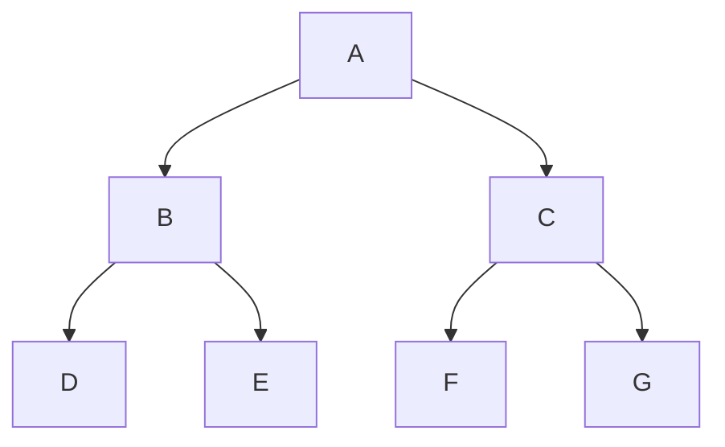

# 期约 Promise

:::info 由来
期约是对尚不存在结果的一个替身。期约（promise）这个名字最早是由 Daniel Friedman 和 David Wise 在他们于 1976 年发表的论文“The Impact of Applicative Programming on Multiprocessing”中提出来的。但直到十几年以后，Barbara Liskov 和 Liuba Shrira 在 1988 年发表了论文“Promises: Linguistic Support for Efficient Asynchronous Procedure Calls in Distributed Systems”，这个概念才真正确立下来。同一时期的计算机科学家还使用了“终局”（eventual）、“期许”（future）、“延迟”（delay）和“迟付”（deferred）等术语指代同样的概念。所有这些概念描述的都是一种异步程序执行的机制。
:::

## Promises/A+规范

早期的期约机制在 jQuery 和 Dojo 中是以 Deferred API 的形式出现的。到了 2010 年，CommonJS 项目实现的 Promises/A 规范日益流行起来。Q 和 Bluebird 等第三方 JavaScript 期约库也越来越得到社区认可，虽然这些库的实现多少都有些不同。为弥合现有实现之间的差异，2012 年 Promises/A+组织分叉（fork）了 CommonJS 的 Promises/A 建议，并以相同的名字制定了 Promises/A+规范。这个规范最终成为了ECMAScript 6 规范实现的范本。

ECMAScript 6 增加了对 Promises/A+规范的完善支持，即 Promise 类型。一经推出，Promise 就大受欢迎，成为了主导性的异步编程机制。所有现代浏览器都支持 ES6 期约，很多其他浏览器 API（如fetch()和 Battery Status API）也以期约为基础。

## 期约基础

ECMAScript 6 新增的引用类型 Promise，可以通过 new 操作符来实例化。创建新期约时需要传入执行器（executor）函数作为参数（后面马上会介绍）。

```js title="演示代码"
// logs Promise 必须提供执行器函数，否则就会抛出 SyntaxError
let p = new Promise(() => {});
console.log(p); // logs Promise <pending>
```

### 期约状态机

在把一个期约实例传给 `console.log()` 时，控制台输出（可能因浏览器不同而略有差异）表明该实例处于待定（pending）状态。如前所述，期约是一个有状态的对象，可能处于如下 3 种状态之一：

- [ ] `pending` 待定
- [ ] `fulfilled` 兑现，有时候也称为 “解决”(`resolved`)
- [ ] `rejected` 拒绝

`pending` 是期约的最初转状态。在待定状态下，期约可以落定为代表成功的 `fulfilled`，或者代表失败的 `rejected` 状态。无论落定为哪种状态都是不可逆的。只要从待定转换为兑现或拒绝，期约的状态就不再改变。而且，也不能保证期约必定会脱离待定状态。因此，组织合理的代码无论期约解决（resolve）还是拒绝（reject），甚至永远处于待定（pending）状态，都应该具有恰当的行为。

### 解决值、拒绝理由及期约用例

期约是JavaScript中处理异步操作的一种机制。在Promise中，有一个私有的内部值，通常称为 `value`，它表示期约的最终结果或拒绝原因。

当期约的状态发生变化时，将触发相应的处理程序。如果状态变为兑现，与之相关的 `value` 将被传递给兑现处理程序；如果状态变为拒绝，拒绝原因 `reason` 将传递给拒绝处理程序。

```js title="演示代码"
const p = new Promise((resolve, reject) => {
  // logs 异步操作
  const isSuccess = true; // logs 假设异步操作成功
  if (isSuccess) {
    resolve('成功的结果');
  } else {
    reject('失败的原因');
  }
});

p.then(
  value => {
    console.log('兑现：', value);
  },
  reason => {
    console.log('拒绝：', reason);
  },
);
```

### 通过执行函数控制期约状态

由于期约的状态是私有的，所以只能在内部进行操作。内部操作在期约的执行器函数中完成。执行器函数主要有两项职责：初始化期约的异步行为和控制状态的最终转换。其中，控制期约状态的转换是通过调用它的两个函数参数实现的。这两个函数参数通常都命名为 `resolve()` 和 `reject()`。调用 `resolve()` 会把状态切换为兑现，调用 `reject()` 会把状态切换为拒绝。

```js
const p1 = new Promise((resolve, reject) => resolve());
setTimeout(console.log, 0, p1); // logs Promise <fulfilled>

const p2 = new Promise((resolve, reject) => reject());
setTimeout(console.log, 0, p2); // logs Promise <rejected>
```

无论 `resolve()` 和 `reject()` 中的哪个被调用，状态转换都不可撤销了。于是继续修改状态会静默失败，如下所示：

```js title="演示状态不可撤销"
let p = new Promise((resolve, reject) => {
  resolve();
  reject(); // logs 没有效果
});

setTimeout(console.log, 0, p); // logs Promise <fulfilled>
```

为避免期约卡在待定状态，可以添加一个定时退出功能。比如，可以通过 setTimeout 设置一个 10 秒钟后无论如何都会拒绝期约的回调：

```js title="定时状态进入拒绝"
let p = new Promise((resolve, reject) => {
  setTimeout(reject, 10000); // logs 10 秒后调用 reject()
  // logs 执行函数的逻辑
});

setTimeout(console.log, 0, p); // logs Promise <pending>
setTimeout(console.log, 11000, p); // logs 11 秒后再检查状态

/**
 * 10s 在定时器回调函数执行了 reject 函数，让没有通过 p.catch 去捕获就会抛出error
 * 11s p状态已经由 pending 转 rejected 状态了
 */
// logs (After 10 seconds) Uncaught error
// logs (After 11 seconds) Promise <rejected>
```

因为期约的状态只能改变一次，所以这里的超时拒绝逻辑中可以放心地设置让期约处于待定状态的最长时间。如果执行器中的代码在超时之前已经解决或拒绝，那么超时回调再尝试拒绝也会静默失败

### Promise.resolve()

期约并非一开始就必须处于待定状态，然后通过执行器函数才能转换为落定状态。通过调用 `Promise.resolve` 静态方法，可以实例化一个状态为 `fulfilled` 的期约。

```js title="演示代码"
// logs 两个期约实例实际上是一样的
let p1 = new Promise((resolve, reject) => resolve());
let p2 = Promise.resolve();
```

这个解决的期约的值 `value` 对应着传给 `Promise.resolve()` 的第一个参数。使用这个静态方法，实际上可以把任何值都转换为一个期约：

```js title="演示传入期约值"
setTimeout(console.log, 0, Promise.resolve());
// logs Promise <resolved>: undefined

setTimeout(console.log, 0, Promise.resolve(3));
// logs Promise <resolved>: 3

// logs 多余的参数会忽略, 编译器也会给予警告提示
setTimeout(console.log, 0, Promise.resolve(4, 5, 6));
// logs Promise <resolved>: 4
```

对这个静态方法而言，如果传入的参数本身是一个期约，那它的行为就类似于一个空包装。因此，`Promise.resolve()` 可以说是一个幂等方法("幂等" 是指一个操作应用任意多次，其效果相同于应用一次的性质)，如下所示：

```js
let p = Promise.resolve(7);
setTimeout(console.log, 0, p === Promise.resolve(p));
// logs true
setTimeout(console.log, 0, p === Promise.resolve(Promise.resolve(p)));
// logs true

// logs 这个幂等性会保留传入期约的状态：

let p2 = new Promise(() => {});
setTimeout(console.log, 0, p2); // logs Promise <pending>
setTimeout(console.log, 0, Promise.resolve(p2)); // logs Promise <pending>
setTimeout(console.log, 0, p2 === Promise.resolve(p2)); // logs true
```

注意，这个静态方法能够包装任何非期约值，包括错误对象，并将其转换为解决的期约。因此，也可能导致不符合预期的行为：

```js
let p = Promise.resolve(new Error('foo'));
setTimeout(console.log, 0, p);
// logs Promise <resolved>: Error: foo
```

### Promise.reject()

与 `Promise.resolve()` 类似，`Promise.reject()` 会实例化一个状态为 `rejected` 的期约并抛出一个异步错误（这个错误不能通过 `try/catch` 捕获，而只能通过拒绝处理程序捕获）。

```js title="演示代码"
// logs 两个期约实例实际上是一样的
let p1 = new Promise((resolve, reject) => reject());
let p2 = Promise.reject();
```

这个拒绝的期约的理由 `reason` 就是传给 `Promise.reject()` 的第一个参数。这个参数也会传给后续的拒绝处理程序：

```js
let p = Promise.reject(3);
setTimeout(console.log, 0, p); // logs Promise <rejected>: 3

p.then(null, e => setTimeout(console.log, 0, e)); // logs 3
```

关键在于，`Promise.reject()` 并没有照搬` Promise.resolve()` 的幂等逻辑。如果给它传一个期约对象，则这个期约会成为它返回的拒绝期约的理由：

```js
setTimeout(console.log, 0, Promise.reject(Promise.resolve()));
// logs Promise <rejected>: Promise <resolved>
```

### 同步 / 异步执行的二元性

Promise 的设计很大程度上会导致一种完全不同于 JavaScript 的计算模式。下面的例子完美地展示了这一点，其中包含了两种模式下抛出异常的情形：

```js
try {
  throw new Error('异常');
} catch (e) {
  console.log(e); // logs Error: 异常
}

try {
  Promise.reject(new Error('异常'));
} catch (e) {
  console.log(e);
}
// logs Uncaught (in promise) Error: 异常
```

第一个 `try/catch` 抛出并捕获了错误，第二个 `try/catch` 抛出错误却没有捕获到。乍一看这可能有点违反直觉，因为代码中确实是同步创建了一个拒绝的期约实例，而这个实例也抛出了包含拒绝理由的错误。这里的同步代码之所以没有捕获期约抛出的错误，是因为它没有通过异步模式捕获错误。从这里就可以看出期约真正的异步特性：它们是同步对象（在同步执行模式中使用），但也是异步执行模式的媒介。

在前面的例子中，拒绝期约的错误并没有抛到执行同步代码的线程里，而是通过浏览器异步消息队列来处理的。因此，`try/catch` 块并不能捕获该错误。代码一旦开始以异步模式执行，则唯一与之交互的方式就是使用异步结构——更具体地说，就是期约的方法。

## 期约的实例方法

期约实例的方法是连接外部同步代码与内部异步代码之间的桥梁。这些方法可以访问异步操作返回的数据，处理期约成功和失败的结果，连续对期约求值，或者添加只有期约进入终止状态时才会执行的代码。

### 实现 Thenable 接口

在 ECMAScript 暴露的异步结构中，任何对象都有一个 then() 方法。该方法被认为实现了 Thenable 接口。下面的例子展示了实现这一类接口的最简单的类：

```js
class MyThenable {
  then() {}
}
```

ECMAScript 的 Promise 类型实现了 Thenable 接口。这个简化的接口跟 TypeScript 或其他包中的接口或类型定义不同，它们都设定了 Thenable 接口更具体的形式。

### Promise.prototype.then()

`Promise.prototype.then()` 是为期约实例添加处理程序的主要方法。这个 `then()` 方法接收最多两个参数：onResolved 处理程序和 onRejected 处理程序。这两个参数都是可选的，如果提供的话，则会在期约分别进入“兑现”和“拒绝”状态时执行。

```js
function onResolved(value) {
  // logs 处理成功状态
  console.log(value);
}

function onRejected(reason) {
  // logs 处理失败状态
  console.log(reason);
}

const p = new Promise((resolve, reject) => {
  let isSuccess = true;
  if (isSuccess) {
    return resolve('成功');
  }

  reject('失败');
});

p.then(onResolved, onRejected);
// logs 等价于如下
p.then(
  value => onResolved(value),
  reason => onRejected(reason),
);
```

因为期约只能转换为最终状态一次，所以这两个操作一定是互斥的。

如前所述，两个处理程序参数都是可选的。而且，传给 `then()` 的任何非函数类型的参数都会被静默忽略。如果想只提供 onRejected 参数，那就要在 onResolved 参数的位置上传入 `null` 或 `undefined`。这样有助于避免在内存中创建多余的对象，对期待函数参数的类型系统也是一个交代。

```js
function onRejected(reason) {
  // logs 处理失败状态
  console.log(reason);
}

const p = new Promise(() => {});

// logs 非函数处理程序会被静默忽略，不推荐
p.then('javascript');

// logs 不传 onResolved 处理程序的规范写法
p.then(null, reason => onRejected(reason));
```

Promise.prototype.then()方法返回一个新的期约实例：

```js
let p1 = new Promise(() => {});
let p2 = p1.then();

setTimeout(console.log, 0, p1); // logs Promise <pending>
setTimeout(console.log, 0, p2); // logs Promise <pending>
setTimeout(console.log, 0, p1 === p2); // logs false
```

这个新期约实例基于 onResolved 处理程序的返回值构建。换句话说，该处理程序的返回值会通过 `Promise.resolve()` 包装来生成新期约。如果没有提供这个处理程序，则 `Promise.resolve()` 就会包装上一个期约解决之后的值。如果没有显式的返回语句，则 `Promise.resolve()` 会包装默认的返回值 `undefined`。

```js title="用代码解释这段话"
/**
 * 第一种提供 onResolved 处理程序
 * 那么返回的期约 value 值取决于 onResolved 返回值
 */
function onResolved() {
  return 'javascript';
}

const p1 = Promise.resolve();
const p2 = p1.then(onResolved);

setTimeout(console.log, 0, p1); // logs Promise {<fulfilled>: undefined}
setTimeout(console.log, 0, p2); // logs Promise {<fulfilled>: 'javascript'}

/**
 * 第二种不提供处理程序，但是在 Promise.resolve() 提供期约返回值
 */
const p3 = Promise.resolve('javascript');
const p4 = p3.then();

setTimeout(console.log, 0, p3); // logs Promise {<fulfilled>: 'javascript'}
setTimeout(console.log, 0, p4); // logs Promise {<fulfilled>: 'javascript'}

/**
 * 值得注意的是，不论p1和p2，还是p3和p4 它们都不会相等，是完全不同的期约
 */
console.log(p1 === p2); // logs false
console.log(p3 === p4); // logs false
```

抛出异常会返回拒绝的期约：

```js
const p1 = Promise.resolve();
let p2 = p1.then(() => {
  throw 'error';
});
// logs Uncaught (in promise) error
setTimeout(console.log, 0, p2); // logs Promise <rejected> error
```

注意，如果是返回错误值是不会返回**拒绝的期约**，而会把错误对象包装在一个**解决的期约**中：

```js
const p1 = Promise.resolve();
let p3 = p1.then(() => Error('error'));
setTimeout(console.log, 0, p3); // logs Promise <fulfilled>: Error: error
```

onRejected 处理程序也与之类似：onRejected 处理程序返回的值也会被 `Promise.resolve()` 包装。乍一看这可能有点违反直觉，但是想一想，onRejected 处理程序的任务不就是捕获异步错误吗？因此，**拒绝处理程序在捕获错误后不抛出异常是符合期约的行为，应该返回一个解决期约。**

```js {1} title="代码示例"
let p1 = Promise.reject('foo');
// logs 调用 then()时不传处理程序则原样向后传
let p2 = p1.then();

// logs Uncaught (in promise) foo
setTimeout(console.log, 0, p2); // logs Promise <rejected>: foo

// logs 这些都一样
let p3 = p1.then(null, () => undefined);
let p4 = p1.then(null, () => {});
let p5 = p1.then(null, () => Promise.resolve());
setTimeout(console.log, 0, p3); // logs Promise <resolved>: undefined
setTimeout(console.log, 0, p4); // logs Promise <resolved>: undefined
setTimeout(console.log, 0, p5); // logs Promise <resolved>: undefined

// logs 这些都一样
let p6 = p1.then(null, () => 'bar');
let p7 = p1.then(null, () => Promise.resolve('bar'));
setTimeout(console.log, 0, p6); // logs Promise <resolved>: bar
setTimeout(console.log, 0, p7); // logs Promise <resolved>: bar

// logs Promise.resolve()保留返回的期约
let p8 = p1.then(null, () => new Promise(() => {}));
let p9 = p1.then(null, () => Promise.reject());

// logs Uncaught (in promise): undefined
setTimeout(console.log, 0, p8); // logs Promise <pending>
setTimeout(console.log, 0, p9); // logs Promise <rejected>: undefined
let p10 = p1.then(null, () => {
  throw 'baz';
});

// logs Uncaught (in promise) baz
setTimeout(console.log, 0, p10); // logs Promise <rejected>: baz
let p11 = p1.then(null, () => Error('qux'));
setTimeout(console.log, 0, p11); // logs Promise <resolved>: Error: qux
```

### Promise.prototype.catch()

`Promise.prototype.catch()` 方法用于给期约添加拒绝处理程序。这个方法只接收一个参数：onRejected 处理程序。事实上，这个方法就是一个语法糖，调用它就相当于调用 `Promise.prototype.then(null, onRejected)`。

```js
let p = Promise.reject();
let onRejected = function (e) {
  setTimeout(console.log, 0, 'rejected');
};
// logs 这两种添加拒绝处理程序的方式是一样的：
p.then(null, onRejected); // logs rejected
p.catch(onRejected); // logs rejected
```

`Promise.prototype.catch()` 返回一个新的期约实例

```js
let p1 = new Promise(() => {});
let p2 = p1.catch();
setTimeout(console.log, 0, p1); // logs Promise <pending>
setTimeout(console.log, 0, p2); // logs Promise <pending>
setTimeout(console.log, 0, p1 === p2); // logs false
```

在返回新期约实例方面，`Promise.prototype.catch()` 的行为与 `Promise.prototype.then()` 的 onRejected 处理程序是一样的。

### Promise.prototype.finally()

`Promise.prototype.finally()` 方法用于给期约添加 onFinally 处理程序，这个处理程序在期约转换为解决或拒绝状态时都会执行。这个方法可以避免 onResolved 和 onRejected 处理程序中出现冗余代码。但 onFinally 处理程序没有办法知道期约的状态是解决还是拒绝，所以这个方法主要用于添加清理代码。

```js
let p1 = Promise.resolve();
let p2 = Promise.reject();
let onFinally = function () {
  setTimeout(console.log, 0, 'Finally!');
};
p1.finally(onFinally); // logs Finally
p2.finally(onFinally); // logs Finally
```

`Promise.prototype.finally()` 方法返回一个新的期约实例：

```js
let p1 = new Promise(() => {});
let p2 = p1.finally();

setTimeout(console.log, 0, p1); // logs Promise <pending>
setTimeout(console.log, 0, p2); // logs Promise <pending>
setTimeout(console.log, 0, p1 === p2); // logs false
```

这个新期约实例不同于 then()或 catch()方式返回的实例。因为 onFinally 被设计为一个状态无关的方法，所以在大多数情况下它将表现为父期约的传递。对于已解决状态和被拒绝状态都是如此。

```js
let p1 = Promise.resolve('foo');

// logs 这里都会原样后传
let p2 = p1.finally();
let p3 = p1.finally(() => undefined);
let p4 = p1.finally(() => {});
let p5 = p1.finally(() => Promise.resolve());
let p6 = p1.finally(() => 'bar');
let p7 = p1.finally(() => Promise.resolve('bar'));
let p8 = p1.finally(() => Error('qux'));

setTimeout(console.log, 0, p2); // logs Promise <resolved>: foo
setTimeout(console.log, 0, p3); // logs Promise <resolved>: foo
setTimeout(console.log, 0, p4); // logs Promise <resolved>: foo
setTimeout(console.log, 0, p5); // logs Promise <resolved>: foo
setTimeout(console.log, 0, p6); // logs Promise <resolved>: foo
setTimeout(console.log, 0, p7); // logs Promise <resolved>: foo
setTimeout(console.log, 0, p8); // logs Promise <resolved>: foo
```

如果返回的是一个待定的期约，或者 onFinally 处理程序抛出了错误（显式抛出或返回了一个拒绝期约），则会返回相应的期约（待定或拒绝），如下所示：

```js
// logs Promise.resolve()保留返回的期约
let p9 = p1.finally(() => new Promise(() => {}));
let p10 = p1.finally(() => Promise.reject());

// logs Uncaught (in promise): undefined
setTimeout(console.log, 0, p9); // logs Promise <pending>
setTimeout(console.log, 0, p10); // logs Promise <rejected>: undefined
let p11 = p1.finally(() => {
  throw 'baz';
});

// logs Uncaught (in promise) baz
setTimeout(console.log, 0, p11); // logs Promise <rejected>: baz
```

返回待定期约的情形并不常见，这是因为只要期约一解决，新期约仍然会原样后传初始的期约：

```js
let p1 = Promise.resolve('foo');
// logs 忽略解决的值
let p2 = p1.finally(
  () => new Promise((resolve, reject) => setTimeout(() => resolve('bar'), 100)),
);
setTimeout(console.log, 0, p2); // logs Promise <pending>
setTimeout(() => setTimeout(console.log, 0, p2), 200);
// logs 200 毫秒后：
// logs Promise <resolved>: foo
```

### 非重入期约方法

"非重入" 特性确保当 Promise 进入已解决（fulfilled）或已拒绝（rejected）状态时，与该状态相关的处理程序不会立即执行，而是会被排入进消息队列等待执行。这确保了在添加处理程序的代码之后的同步代码会在处理程序之前执行。

```js title="演示非重入特性"
const promise = new Promise(resolve => {
  console.log('Promise executor');
  resolve('Resolved value');
});

promise.then(value => {
  console.log('Promise handler 1:', value);
});

promise.then(value => {
  console.log('Promise handler 2:', value);
});

console.log('Synchronous code');

// logs 输出：
// logs Promise executor
// logs Synchronous code
// logs Promise handler 1: Resolved value
// logs Promise handler 2: Resolved value
```

在这个例子中，Promise 的执行器函数中的代码会立即执行，但 then 方法中的处理程序并不会立即执行。相反，它们会被排入消息队列，并在主线程执行栈清空后才会执行。这就是非重入特性的体现。

非重入适用于 `onResolved` / `onRejected` 处理程序、`catch()` 处理程序和 `finally()` 处理程序。

```js
let p1 = Promise.resolve();
p1.then(() => console.log('p1.then() onResolved'));
console.log('p1.then() returns');

let p2 = Promise.reject();
p2.then(null, () => console.log('p2.then() onRejected'));
console.log('p2.then() returns');

let p3 = Promise.reject();
p3.catch(() => console.log('p3.catch() onRejected'));
console.log('p3.catch() returns');

let p4 = Promise.resolve();
p4.finally(() => console.log('p4.finally() onFinally'));
console.log('p4.finally() returns');

// logs p1.then() returns
// logs p2.then() returns
// logs p3.catch() returns
// logs p4.finally() returns

// logs p1.then() onResolved
// logs p2.then() onRejected
// logs p3.catch() onRejected
// logs p4.finally() onFinally
```

### 邻近处理程序的执行顺序

如果给期约 Promise 添加了多个处理程序，当期约状态变化时，相关处理程序会按照添加它们的顺序依次执行。无论是 `then()`、`catch()` 还是 `finally()` 添加的处理程序都是如此。

```js
let p1 = Promise.resolve();
let p2 = Promise.reject();

p1.then(() => setTimeout(console.log, 0, 1));
p1.then(() => setTimeout(console.log, 0, 2));
// logs 1
// logs 2

p2.then(null, () => setTimeout(console.log, 0, 3));
p2.then(null, () => setTimeout(console.log, 0, 4));
// logs 3
// logs 4

p2.catch(() => setTimeout(console.log, 0, 5));
p2.catch(() => setTimeout(console.log, 0, 6));
// logs 5
// logs 6

p1.finally(() => setTimeout(console.log, 0, 7));
p1.finally(() => setTimeout(console.log, 0, 8));
// logs 7
// logs 8
```

### 传递解决值和拒绝理由

在执行函数中，解决的值和拒绝的理由是分别作为 `resolve()` 和 `reject()` 的第一个参数往后传的。然后，这些值又会传给它们各自的处理程序，作为 onResolved 或 onRejected 处理程序的唯一参数。下面的例子展示了上述传递过程：

```js
let p1 = new Promise((resolve, reject) => resolve('success'));
p1.then(value => console.log(value)); // logs success
let p2 = new Promise((resolve, reject) => reject('error'));
p2.catch(reason => console.log(reason)); // logs error
```

`Promise.resolve()` 和 `Promise.reject()` 在被调用时就会接收解决值和拒绝理由。同样地，它们返回的期约也会像执行器一样把这些值传给 onResolved 或 onRejected 处理程序：

```js {1,4}
let p1 = Promise.resolve('success');
p1.then(value => console.log(value)); // logs success

let p2 = Promise.reject('error');
p2.catch(reason => console.log(reason)); // logs error
```

### 拒绝期约与拒绝错误处理

拒绝期约类似于 throw() 表达式，因为它们都代表一种程序状态，即需要中断或特殊处理。在期约的执行函数或处理程序中抛出错误会导致拒绝，对应应的错误对象会成为拒绝的理由。因此以下这些期约都会以一个错误对象为由被拒绝：

```js
let p1 = new Promise((resolve, reject) => reject(Error('error')));
let p2 = new Promise((resolve, reject) => {
  throw Error('error');
});
let p3 = Promise.resolve().then(() => {
  throw Error('then() return error');
});
let p4 = Promise.reject(Error('error'));

setTimeout(console.log, 0, p1); // Promise <rejected>: Error: error
setTimeout(console.log, 0, p2); // Promise <rejected>: Error: error
setTimeout(console.log, 0, p3); // Promise <rejected>: then() return error
setTimeout(console.log, 0, p4); // Promise <rejected>: Error: error
// 也会抛出 4 个未捕获错误
```

期约可以以任何理由拒绝，包括 undefined，但最好统一使用错误对象。这样做主要是因为创建错误对象可以让浏览器捕获错误对象中的栈追踪信息，而这些信息对调试是非常关键的。例如，前面例子中抛出的 4 个错误的栈追踪信息如下：


所有错误都是异步抛出且未处理的，通过错误对象捕获的栈追踪信息展示了错误发生的路径。注意错误的顺序：Promise.resolve().then()的错误最后才出现，这是因为它需要在运行时消息队列中添加处理程序；也就是说，在最终抛出未捕获错误之前它还会创建另一个期约。

这个例子同样揭示了异步错误有意思的副作用。正常情况下，在通过 `throw()` 关键字抛出错误时，JavaScript 运行时的错误处理机制会停止执行抛出错误之后的任何指令：

```js
throw Error('foo');
console.log('bar'); // 这一行不会执行
// Uncaught Error: foo
```

但是，在期约中抛出错误时，因为错误实际上是从消息队列中异步抛出的，所以并不会阻止运行时继续执行同步指令：

```js
Promise.reject(Error('foo'));
console.log('bar');
// bar
// Uncaught (in promise) Error: foo
```

Promise 异步错误只能通过异步的 onRejected 处理程序捕获：

```js title="捕获异步错误"
// 正确
Promise.reject(Error('foo')).catch(e => {});

// 不正确
try {
  Promise.reject(Error('foo'));
} catch (e) {}
```

这不包括捕获执行函数中的错误，在解决或拒绝期约之前，仍然可以使用 try/catch 在执行函数中捕获错误：

```js
let p = new Promise((resolve, reject) => {
  try {
    throw Error('error');
  } catch (e) {
    console.log(e);
  }
  resolve('success');
});

// Error: error
setTimeout(console.log, 0, p); // Promise <fulfilled>: error
```

`then()` 和 `catch()` 的 onRejected 处理程序在语义上相当于 try/catch。出发点都是捕获错误之后将其隔离，同时不影响正常逻辑执行。为此，_onRejected 处理程序的任务应该是在捕获异步错误之后返回一个解决的期约_。

```js title="对比同步错误处理与异步错误处理"
/**
 * 同步错误
 */
console.log('begin synchronous execution');
try {
  throw Error('foo');
} catch (e) {
  console.log('caught error', e);
}
console.log('continue synchronous execution');

// begin synchronous execution
// caught error Error: foo
// continue synchronous execution

/**
 * 异步错误
 */
new Promise((resolve, reject) => {
  console.log('begin asynchronous execution');
  reject(Error('bar'));
})
  .catch(e => {
    console.log('caught error', e);
  })
  // .then() 之所以执行了,是因为 onRejected 处理程序返回了一个解决的期约
  // highlight-start
  .then(() => {
    console.log('continue asynchronous execution');
  });
// highlight-end

// begin asynchronous execution
// caught error Error: bar
// continue asynchronous execution
```

## 期约连锁与期约合成

多个期约组合在一起可以构成强大的代码逻辑。这种组合可以通过两种方式实现：期约连锁与期约合成。前者就是一个期约接一个期约地拼接，后者则是将多个期约组合为一个期约。

### 期约连锁

把期约逐个地串联起来是一种非常有用的编程模式。之所以可以这样做，是因为每个期约实例的方法（`then()`、`catch()` 和 `finally()`）都会返回一个新的期约对象，而这个新期约又有自己的实例方法。这样连缀方法调用就可以构成所谓的“期约连锁”。比如：

```js
let p = new Promise((resolve, reject) => {
  console.log('first');
  resolve();
});

p.then(() => console.log('second'))
  .then(() => console.log('third'))
  .then(() => console.log('fourth'));

// first
// second
// third
// fourth
```

这个实现最终执行了一连串同步任务。要真正执行异步任务，可以改写前面的例子，让每个执行器都返回一个期约实例。这样就可以让每个后续期约都等待之前的期约，也就是串行化异步任务。比如，可以像下面这样让每个期约在一定时间后解决：

```js
let p1 = new Promise((resolve, reject) => {
  console.log('p1 executor');
  setTimeout(resolve, 1000);
});
p1.then(
  () =>
    new Promise((resolve, reject) => {
      console.log('p2 executor');
      setTimeout(resolve, 1000);
    }),
)
  .then(
    () =>
      new Promise((resolve, reject) => {
        console.log('p3 executor');
        setTimeout(resolve, 1000);
      }),
  )
  .then(
    () =>
      new Promise((resolve, reject) => {
        console.log('p4 executor');
        setTimeout(resolve, 1000);
      }),
  );
// p1 executor（1 秒后）
// p2 executor（2 秒后）
// p3 executor（3 秒后）
// p4 executor（4 秒后）
```

### 期约图

因为一个期约可以有任意多个处理程序，所以期约连锁可以构建有向非循环图的结构。这样，每个期约都是图中的一个节点，而使用实例方法添加的处理程序则是有向顶点。因为图中的每个节点都会等待前一个节点落定，所以图的方向就是期约的解决或拒绝顺序。

下面的例子展示了一种期约有向图，也就是二叉树：



```js title="代码执行顺序如上图二叉树的层序遍历"
let A = new Promise((resolve, reject) => {
  console.log('A');
  resolve();
});

let B = A.then(() => console.log('B'));
let C = A.then(() => console.log('C'));
B.then(() => console.log('D'));
B.then(() => console.log('E'));
C.then(() => console.log('F'));
C.then(() => console.log('G'));
```

注意，日志的输出语句是对二叉树的层序遍历。如前所述，期约的处理程序是按照它们添加的顺序执行的。由于期约的处理程序是先添加到消息队列，然后才逐个执行，因此构成了层序遍历。

树只是期约图的一种形式。考虑到根节点不一定唯一，且多个期约也可以组合成一个期约（通过下一节介绍的 Promise.all()和 Promise.race()），所以有向非循环图是体现期约连锁可能性的最准确表达。

### Promise.all()和 Promise.race()

Promise 类提供两个将多个期约实例组合成一个期约的静态方法：`Promise.all()` 和 `Promise.race()`。而合成后期约的行为取决于内部期约的行为。

#### Promise.all()

`Promise.all()` 静态方法创建的期约会在一组期约全部解决之后再解决。这个静态方法接收一个可迭代对象，返回一个新期约：

```js
let p1 = Promise.all([Promise.resolve(), Promise.resolve()]);

// 可迭代对象中的元素会通过 Promise.resolve()转换为期约
let p2 = Promise.all([3, 4]);

// 空的可迭代对象等价于 Promise.resolve()
let p3 = Promise.all([]);

// 无效的语法，必须传入可迭代的对象
let p4 = Promise.all();
// TypeError: cannot read Symbol.iterator of undefined
```

合成的期约只会在每个元素的期约都解决之后才解决：

```js
let p = Promise.all([
  Promise.resolve(),
  new Promise((resolve, reject) => setTimeout(resolve, 1000)),
]);

setTimeout(console.log, 0, p); // Promise <pending>
// 等待一秒后，合成期约兑现
setTimeout(console.log, 1000, p); // Promise <fulfilled>
```

如果至少有一个包含的期约待定（即期约处于pending状态），则合成的期约也会待定。如果有一个包含的期约拒绝，则合成的期约也会拒绝：

```js
// 永远待定 pending状态
let p1 = Promise.all([new Promise(() => {})]);
setTimeout(console.log, 0, p1); // Promise <pending>

// 一次拒绝会导致最终期约拒绝
let p2 = Promise.all([
  Promise.resolve(),
  Promise.reject('error'),
  Promise.resolve(),
]);
setTimeout(console.log, 0, p2); // Promise <rejected> error
// Uncaught (in promise) error
```

如果所有期约都成功解决，则合成期约的解决值就是所有包含期约解决值的数组，按照迭代器顺序：

```js
let p = Promise.all([
  Promise.resolve(3),
  Promise.resolve(4),
  Promise.resolve(5),
]);
p.then(values => setTimeout(console.log, 0, values)); // [3, 4, 5]
```

如果有期约拒绝，则第一个拒绝的期约会将自己的理由作为合成期约的拒绝理由。之后再拒绝的期约不会影响最终期约的拒绝理由。**合成的期约会静默处理所有包含期约的拒绝操作**，如下所示：

```js
// 虽然只有第一个期约的拒绝理由会进入
// 拒绝处理程序，第二个期约的拒绝也
// 会被静默处理，不会有错误跑掉
let p = Promise.all([
  Promise.reject(3),
  new Promise((resolve, reject) => setTimeout(reject, 1000)),
]);
p.catch(reason => setTimeout(console.log, 0, reason)); // 3
// 没有未处理的错误
```

#### Promise.race()

`Promise.race()` 静态方法返回一个包装期约，是一组集合中最先解决或拒绝的期约的镜像。这个方法接收一个可迭代对象，返回一个新期约：

### 期约合成

```js
let p1 = Promise.race([Promise.resolve(), Promise.resolve()]);

// 可迭代对象中的元素会通过 Promise.resolve()转换为期约
let p2 = Promise.race([3, 4]);

// 空的可迭代对象等价于 new Promise(() => {})
let p3 = Promise.race([]);

// 无效的语法
let p4 = Promise.race();
// TypeError: cannot read Symbol.iterator of undefined
```

`Promise.race()` 不会对解决或拒绝的期约区别对待。无论是解决还是拒绝，只要是第一个落定的期约，`Promise.race()` 就会包装其解决值或拒绝理由并返回新期约：

```js
/*解决先发生，超时后的拒绝被忽略*/
let p1 = Promise.race([
  Promise.resolve('success01'),
  new Promise((resolve, reject) => setTimeout(reject, 1000)),
]);
// 等待一秒打印，来证明结果并不会被后面的期约状态改变
setTimeout(console.log, 1000, p1); // Promise <resolved>: success01

/*拒绝先发生，超时后的解决被忽略*/
let p2 = Promise.race([
  Promise.reject('error02'),
  new Promise((resolve, reject) => setTimeout(resolve, 1000)),
]);
setTimeout(console.log, 1000, p2); // Promise <rejected>: error02

// 迭代顺序决定了落定顺序
let p3 = Promise.race([
  Promise.resolve(1),
  Promise.resolve(2),
  Promise.resolve(3),
]);
setTimeout(console.log, 0, p3); // Promise <resolved>: 1
```

如果有一个期约拒绝，只要它是第一个落定的，就会成为拒绝合成期约的理由。之后再拒绝的期约不会影响最终期约的拒绝理由。与 `Promise.all()` 类似，合成的期约会静默处理所有包含期约的拒绝操作，如下所示：

```js
let p = Promise.race([
  Promise.reject('error'),
  new Promise((resolve, reject) => setTimeout(reject, 1000)),
]);

p.catch(reason => setTimeout(console.log, 0, reason)); // error
// 没有未处理的错误
```

### 串行期约的合成
