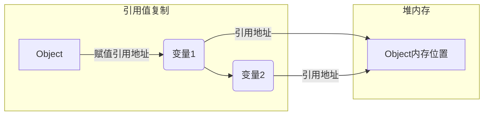
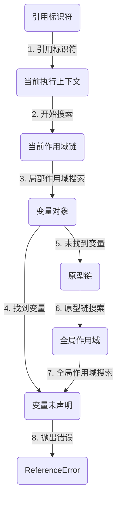

# 变量、作用域与内存

相比于其他语言，JavaScript 中的变量可谓独树一帜。正如 ECMA-262 所规定的，JavaScript 变量是 松散类型的，而且变量不过就是特定时间点一个特定值的名称而已。由于没有规则定义变量必须包含什么数据类型，变量的值和数据类型在脚本生命期内可以改变。这样的变量很有意思，很强大，当然也有不少问题。本章会剖析错综复杂的变量。

## 原始值与引用值

ECMAScript 变量可以包含两种不同类型的数据:原始值和引用值。_原始值(primitive value)_ 就是最简单的数据，_引用值(reference value)_ 则是由多个值构成的对象。

在把一个值赋给变量时，JavaScript 引擎必须确定这个值是原始值还是引用值。在《语言基础》章节了解到7种原始值：`Undefined`、`Null`、`Boolean`、`Number`、`BigInt`、`String` 和 `Symbol`。保存原始值的变量是 _按值(by value)_ 访问的，因为我们操作的就是存储在变量中的实际值。

引用值是保存在内存中的对象。与其他语言不同，JavaScript 不允许直接访问内存位置，因此也就不能直接操作对象所在的内存空间。在操作对象时，实际上操作的是对该对象的引用(reference)而非实际的对象本身。为此，保存引用值的变量是 _按引用(by reference)_ 访问的。

:::note
在很多语言中，字符串是使用对象表示的，因此被认为是引用类型。ECMAScript 打破了这个惯例。
:::

### 动态属性

在JavaScript中，原始值和引用值的行为有很大的不同，尽管它们的定义方式看起来很类似。

原始值是不可变的，即它们的值不能被改变。一旦一个原始值被创建，它的值就不能被改变。原始值不能有属性和方法。即使尝试给原始值添加属性，也不会报错，但这个属性实际上不会存在。

```js
let name = 'Nicholas';
name.age = 27; // 试图给字符串添加属性
console.log(name.age); // undefined
```

引用值是可变的，可以动态添加、修改和删除属性和方法。当你将一个引用值赋值给一个变量时，实际上传递的是对该对象的引用，而不是对象本身。

```js
let person = new Object();
person.name = 'Nicholas';
console.log(person.name); // "Nicholas"
```

注意，原始类型的初始化可以只使用原始字面量形式。如果使用的是 new 关键字，则 JavaScript 会创建一个 Object 类型的实例，但其行为类似原始值。下面来看看这两种初始化方式的差异:

```js
let name1 = 'Nicholas';
let name2 = new String('Matt');

name1.age = 27;
name2.age = 26;

console.log(name1.age); // undefined
console.log(name2.age); // 26

console.log(typeof name1); // string
console.log(typeof name2); // object
```

### 复制值

原始值和引用值在通过变量复制时也有所不同。

原始值在赋值和传递时是值的复制。

想象你有一张纸（原始值），你想要一个副本。所以你用复印机复印了一张。现在，你有两张纸，其中每张纸上的内容都是一样的，但它们是独立的。如果你在其中一张纸上写了新的内容，另一张纸上的内容不会改变。


引用值包括对象、数组和函数。它们在赋值（复制）时实际上复制的是指向内存中实际对象的引用，而不是对象本身的副本。

想象你有一座房子（引用值），这座房子代表在内存中的一个对象。当你把这座房子过户给你的亲人时，他们获得了房子的所有权，也就是说他们可以进入房子、对房子进行装修或改动。即使这个房子焕然一新了，但房子还是最开始的房子。



### 传递参数

ECMAScript 中所有函数的参数都是按值传递的。这意味着函数外的值会被复制到函数内部的参数中，就像从一个变量复制到另一个变量一样。如果是原始值，那么就跟原始值变量的复制一样，如果是引用值，那么就跟引用值变量的复制一样。

对很多开发者来说，这一块可能会不好理解，毕竟变量*原始值按值访问*和*引用值按引用访问*，而传参则只有按值传递。

在按值传递参数时，值会被复制到一个局部变量(即一个命名参数，或者用 ECMAScript 的话说，就是 arguments 对象中的一个槽位)。

_按值传递的含义：_

当你传递一个原始值作为参数时，实际上是将这个值的副本传递给了函数。这意味着函数内部操作的是这个值的副本，而不会影响到原始变量。

```js
function addTen(num) {
  num += 10;
  return num;
}
let count = 20;

let result = addTen(count);
console.log(count); // 20，没有变化
console.log(result); // 30
```

当你传递一个引用值（如对象、数组、函数）作为参数时，实际上是将这个引用值在内存中的地址（指针）传递给了函数。因此，函数内部操作的是这个引用值所指向的对象的实际内容，而不是引用本身。

```js
function setName(obj) {
  obj.name = 'Nicholas';
}

let person = new Object();

setName(person);
console.log(person.name); // "Nicholas"
```

### 确定类型

在《语言基础》章节提到的 `typeof` 操作符最适合用来判断一个变量是否为原始类型。更确切地说，它是判断一个变量是否为字符串、数值、布尔值或 undefined 的最好方式。如果值是对象或 null，那么 typeof 返回"object"。

```js title="示例"
let s = 'Nicholas';
let b = true;
let i = 22;
let u;
let n = null;
let o = new Object();
console.log(typeof s); // string
console.log(typeof i); // number
console.log(typeof b); // boolean
console.log(typeof u); // undefined
console.log(typeof n); // object
console.log(typeof o); // object
```

`typeof` 虽然对原始值很有用，但它对引用值的用处不大。我们通常不关心一个值是不是对象， 而是想知道它是什么类型的对象。为了解决这个问题，ECMAScript 提供了 `instanceof` 操作符。

```js title="instanceof 语法"
result = variable instanceof constructor;
```

如果变量是给定引用类型（由其原型链决定）的实例，则 instanceof 操作符返回 true。

```js
console.log(person instanceof Object); // 变量 person 是 Object 吗?
console.log(colors instanceof Array); // 变量 colors 是 Array 吗?
console.log(pattern instanceof RegExp); // 变量 pattern 是 RegExp 吗?
```

按照定义，所有引用值都是 Object 的实例，因此通过 `instanceof` 操作符检测任何引用值和 Object 构造函数都会返回 true。类似地，如果用 `instanceof` 检测原始值，则始终会返回 false，因为原始值不是对象。

:::info 扩展
`typeof` 操作符对于函数，在所有符合 ECMAScript 标准的浏览器中都应该返回 "function"。对于正则表达式，由于标准中未明确规定其 `typeof` 返回值，因此不同浏览器可能会有不同的行为。早期版本的 Safari 和 Chrome 可能会返回 "function"，而其他浏览器可能会返回 "object"。
:::

## 执行上下文与作用域

执行上下文（Execution Context）和作用域（Scope）是理解 JavaScript 中变量、函数调用和作用域链的核心概念。让我们逐步深入讲解它们的含义和关系。

### 执行上下文

执行上下文（后面简称上下文）是 JavaScript 中代码执行的环境的抽象概念，每当 JavaScript 代码运行时，都会创建上下文。上下文可以理解为包含了当前代码执行所需的所有信息，包括变量的值、函数的引用、调用栈信息等。

#### 类型

JavaScript 中有三种上下文类型：

- [ ] 全局上下文（Global Execution Context）：

* 在代码执行之前，全局上下文会被创建。它是默认的、最外层的上下文，整个 JavaScript 程序运行期间只有一个全局上下文。
* 全局上下文中定义的变量和函数可以被程序的任何部分访问，它们属于全局作用域。

- [ ] 函数上下文（Function Execution Context）：

* 每当一个函数被调用时，都会创建一个新的函数上下文。每个函数都有自己的上下文。
* 函数上下文中包含了函数的局部变量、函数的参数以及函数在调用栈中的位置。

- [ ] Eval 上下文：

* 使用 `eval()` 函数执行的代码会在自己的上下文中运行。

#### 执行上下文的生命周期

上下文的生命周期包括两个阶段：

1. 创建阶段：创建阶段发生在代码执行之前。此阶段包括创建变量对象、确定作用域链、设置 `this` 值等。
2. 执行阶段：创建完成后，上下文进入执行阶段，执行代码并处理变量赋值、函数引用等操作。

### 作用域

作用域是指在程序中定义变量的区域，它规定了变量的可访问性和生命周期。JavaScript 中有以下两种主要的作用域类型：

- [ ] 全局作用域（Global Scope）

全局作用域中定义的变量和函数可以在整个程序中访问，它们在全局上下文中创建。

- [ ] 局部作用域（Local Scope）

局部作用域只在特定的代码段内部有效，如函数内部。每当函数被调用时，都会创建一个新的局部作用域。

在 ES6 之前，JavaScript 只有全局作用域和函数作用域（通过函数创建），ES6 引入了块级作用域（通过 `let` 和 `const` 关键字），使得 `if`、`for` 等语句块也可以创建作用域。

### 作用域链

作用域链是在 JavaScript 中实现词法作用域的一种机制，它用于解析变量和函数的访问权限。作用域链的构建依赖于函数的嵌套关系。

#### 词法作用域

JavaScript 使用词法作用域（也称为静态作用域），也就是变量的作用域在函数定义时就确定了，而不是在函数调用时确定。

#### 作用域链的形成

每当函数被创建时，会保存其父级作用域的引用。在函数执行时，如果访问一个变量，会先在当前函数的作用域中查找，如果找不到，则向上级作用域链继续查找，直到找到变量或到全局作用域。

这种嵌套的作用域链关系决定了函数可以访问哪些变量和函数。

#### 作用域链增强

虽然上下文主要有全局上下文和函数上下文两种(`eval()`调用内部存在第三种上下文)，但有 其他方式来增强作用域链。某些语句会导致在作用域链前端临时添加一个上下文，这个上下文在代码执 行后会被删除。通常在两种情况下会出现这个现象，即代码执行到下面任意一种情况时:

- `try/catch` 语句的 `catch` 块
- `with` 语句

这两种情况下，都会在作用域链前端添加一个变量对象。对 `catch` 语句而言，则会创建一个新的变量对象，这个变量对象会包含要抛出的错误对象的声明。对 `with` 语句来说，会向作用域链前端添加指定的对象。

```js title="示例"
try {
} catch (error) {
  console.log(error); // 错误对象
}

function buildUrl() {
  let qs = '?debug=true';
  with (location) {
    let url = href + qs;
  }
  return url;
}

// error
console.log(buildUrl()); // ReferenceError: url is not defined
```

当 `with` 语句中的代码引用变量 href 时，实际上引用的是 location.href，也就是自己变量对象的属性。

而在 `with` 语句中使用 `var` 声明的变量 url 会成为函数上下文的一部分，可以作为函数的值被返回；但像这里使用 `let` 声明的变量 url，因为被限制在块级作用域，所以下一行报错了。

### 变量声明

ES6 之后，JavaScript 的变量声明经历了翻天覆地的变化。直到 ECMAScript 5.1，`var` 都是声明变量 的唯一关键字。ES6 不仅增加了 `let` 和 `const` 两个关键字，而且还让这两个关键字压倒性地超越 `var` 成为首选。

#### 使用 var 的函数作用域声明

在使用 `var` 声明变量时，变量会被自动添加到最接近的上下文。在函数中，最接近的上下文就是函数的局部上下文。在 `with` 语句中，最接近的上下文也是函数上下文。如果变量未经声明就被初始化了， 那么它就会自动被添加到全局上下文。

```js
function message() {
  var name = 'MoFan';
  age = 18;
}

message();

console.log(name); // undefined
console.log(age); // 18
```

:::danger
在严格模式下，未经声明就初始化变量会报错。
:::

`var` 声明会被拿到函数或全局作用域的顶部，位于作用域中所有代码之前。这个现象叫作“提升” (hoisting)。提升让同一作用域中的代码不必考虑变量是否已经声明就可以直接使用。可是在实践中，提
升也会导致合法却奇怪的现象，即在变量声明之前使用变量。

```js title="全局作用域中两段等价的代码示例"
var name = 'Jake';
// 上下等价于:
name = 'Jake';
var name; // Jake

// 下面是两个等价的函数:
function fn1() {
  var name = 'Jake';
}
// 等价于:
function fn2() {
  name = 'Jake';
  var name;
}
```

通过在声明之前打印变量，可以验证变量会被提升。声明的提升意味着会输出 undefined 而不是 Reference Error:

```js
console.log(name); // undefined
var name = 'Jake';

function fn() {
  console.log(name); // undefined
  var name = 'Jake';
}
```

#### 使用 let 的块级作用域声明

ES6 新增的 `let` 关键字跟 `var` 很相似，但它的作用域是块级的，这也是 JavaScript 中的新概念。块级作用域由最近的一对包含花括号 `{}` 界定。换句话说，`if` 块、`while` 块，甚至连单独 `{}` 的块也是 `let` 声明变量的作用域。

```js
if (true) {
  let a;
  console.log(a); // ReferenceError: a 没有定义
}

while (true) {
  let b;
}
console.log(b); // ReferenceError: b 没有定义

{
  let d;
}
console.log(d); // ReferenceError: d 没有定义
```

`let` 与 `var` 的另一个不同之处是在同一作用域内不能声明两次。重复的 `var` 声明会被忽略，而重复的 `let` 声明会抛出 SyntaxError。

```js
var a;
var a;
// 不会报错

{
  let b;
  let b;
}
// SyntaxError: 标识符 b 已经声明过了
```

严格来讲，`let` 在 JavaScript 运行时中也会被提升，但由于[暂时性死区](/language-basics/#暂时性死区)(temporal dead zone)的缘故，实际上不能在声明之前使用 `let` 变量。因此，从写 JavaScript 代码的角度说，`let` 的提升跟 `var` 是不一样的。

#### 使用 const 的常量声明

除了 `let`，ES6 同时还增加了 `const` 关键字。使用 `const` 声明的变量必须同时初始化为某个值。 一经声明，在其生命周期的任何时候都不能再重新赋予新值。

```js
const a; // SyntaxError: 常量声明时没有初始化
const b = 3;

console.log(b); // 3
b = 4; // TypeError: 给常量赋值
```

`const` 除了要遵循以上规则，其他方面与 `let` 声明是一样的。

`const` 声明只应用到顶级原语或者对象。换句话说，赋值为对象的 `const` 变量不能再被重新赋值为其他引用值，但对象的键则不受限制。

```js
const o1 = {};
o1 = {}; // TypeError: 给常量赋值

const o2 = {};
o2.name = 'Jake';
console.log(o2.name); // 'Jake'
```

如果想让整个对象都不能修改，可以使用 `Object.freeze()`，这样再给属性赋值时虽然不会报错，但会静默失败:

```js
const o3 = Object.freeze({});
o3.name = 'Jake';
console.log(o3.name); // undefined
```

由于 `const` 声明暗示变量的值是单一类型且不可修改，JavaScript 运行时编译器可以将其所有实例都替换成实际的值，而不会通过查询表进行变量查找。谷歌的 V8 引擎就执行这种优化。

:::info 最佳实践
开发实践表明，如果开发流程并不会因此而受很大影响，就应该尽可能地多使用 const 声明，除非确实需要一个将来会重新赋值的变量。这样可以从根本上保证提前发现 重新赋值导致的 bug。
:::

#### 标识符查找

当在特定上下文中为读取或写入而引用一个标识符时，必须通过搜索确定这个标识符表示什么。搜索开始于作用域链前端，以给定的名称搜索对应的标识符。如果在局部上下文中找到该标识符，则搜索停止，变量确定;如果没有找到变量名，则继续沿作用域链搜索。(注意，作用域链中的对象也有一个原型链，因此搜索可能涉及每个对象的原型链)。这个过程一直持续到搜索至全局上下文的变量对象。 如果仍然没有找到标识符，则说明其未声明。



:::note 了解
标识符查找并非没有代价。访问局部变量比访问全局变量要快，因为不用切换作用域。不过，JavaScript 引擎在优化标识符查找上做了很多工作，将来这个差异可能就微不足道了。
:::

## 垃圾回收

JavaScript 是使用垃圾回收的语言，也就是说执行环境负责在代码执行时管理内存。在 C 和 C++等语言中，跟踪内存使用对开发者来说是个很大的负担，也是很多问题的来源。JavaScript 为开发者卸下了这个负担，通过自动内存管理实现内存分配和闲置资源回收。基本思路很简单:确定哪个变量不会再使用，然后释放它占用的内存。这个过程是周期性的，即垃圾回收程序每隔一定时间(或者说在代码执 行过程中某个预定的收集时间)就会自动运行。垃圾回收过程是一个近似且不完美的方案，因为某块内存是否还有用，属于“不可判定的”问题，意味着靠算法是解决不了的。

我们以函数中局部变量的正常生命周期为例。函数中的局部变量会在函数执行时存在。此时，栈(或堆)内存会分配空间以保存相应的值。函数在内部使用了变量，然后退出。此时，就不再需要那个局部变量了，它占用的内存可以释放，供后面使用。这种情况下显然不再需要局部变量了，但并不是所有时候都会这么明显。垃圾回收程序必须跟踪记录哪个变量还会使用，以及哪个变量不会再使用，以便回收内存。如何标记未使用的变量也许有不同的实现方式。不过，在浏览器的发展史上，用到过两种主要的标记策略：*标记清理*和*引用计数*。

### 标记清理

JavaScript 最常用的垃圾回收策略是标记清理(mark-and-sweep)。当变量进入上下文，比如在函数内部声明一个变量时，这个变量会被加上存在于上下文中的标记。而在上下文中的变量，逻辑上讲，永远不应该释放它们的内存，因为只要上下文中的代码在运行，就有可能用到它们。当变量离开上下文时，也会被加上离开上下文的标记。

给变量加标记的方式有很多种。比如，当变量进入上下文时，反转某一位;或者可以维护“在上下文中”和“不在上下文中”两个变量列表，可以把变量从一个列表转移到另一个列表。标记过程的实现并不重要，关键是策略。

垃圾回收程序运行的时候，会标记内存中存储的所有变量(记住，标记方法有很多种)。然后，它会将所有在上下文中的变量，以及被在上下文中的变量引用的变量的标记去掉。在此之后再被加上标记的变量就是待删除的了，原因是任何在上下文中的变量都访问不到它们了。随后垃圾回收程序做一次内存清理，销毁带标记的所有值并收回它们的内存。

到了 2008 年，IE、Firefox、Opera、Chrome 和 Safari 都在自己的 JavaScript 实现中采用标记清理(或其变体)，只是在运行垃圾回收的频率上有所差异。

### 引用清理

另一种没那么常用的垃圾回收策略是引用计数(reference counting)。其思路是对每个值都记录它被引用的次数。声明变量并给它赋一个引用值时，这个值的引用数为 1。如果同一个值又被赋给另一个变量，那么引用数加 1。类似地，如果保存对该值引用的变量被其他值给覆盖了，那么引用数减 1。当一个值的引用数为 0 时，就说明没办法再访问到这个值了，因此可以安全地收回其内存了。垃圾回收程序下次运行的时候就会释放引用数为 0 的值的内存。

引用计数最早由 Netscape Navigator 3.0 采用，但很快就遇到了严重的问题: _循环引用_。所谓循环引用，就是对象 A 有一个指针指向对象 B，而对象 B 也引用了对象 A。

```js title="循环引用"
function problem() {
  let objectA = new Object();
  let objectB = new Object();

  objectA.someOtherObject = objectB;
  objectB.anotherObject = objectA;
}
```

在这个例子中，objectA 和 objectB 通过各自的属性相互引用，意味着它们的引用数都是 2。在标记清理策略下，这不是问题，因为在函数结束后，这两个对象都不在作用域中。而在引用计数策略下，objectA 和 objectB 在函数结束后还会存在，因为它们的引用数永远不会变成 0。如果函数被多次调用，则会导致大量内存永远不会被释放。为此，Netscape 在 4.0 版放弃了引用计数，转而采用标记清理。事实上，引用计数策略的问题还不止于此。

在 IE8 及更早版本的 IE 中，并非所有对象都是原生 JavaScript 对象。BOM 和 DOM 中的对象是 C++ 实现的组件对象模型(COM，Component Object Model)对象，而 COM 对象使用引用计数实现垃圾回收。因此，即使这些版本 IE 的 JavaScript 引擎使用标记清理，JavaScript 存取的 COM 对象依旧使用引用计数。换句话说，只要涉及 COM 对象，就无法避开循环引用问题。下面这个简单的例子展示了涉及 COM 对象的循环引用问题:

```js
let element = document.getElementById('some_element');
let myObject = new Object();
myObject.element = element;
element.someObject = myObject;
```

这个例子在一个 DOM 对象(element)和一个原生 JavaScript 对象(myObject)之间制造了循环引用。myObject 变量有一个名为 element 的属性指向 DOM 对象 element，而 element 对象有一个 someObject 属性指回 myObject 对象。由于存在循环引用，因此 DOM 元素的内存永远不会被回收，即使它已经被从页面上删除了也是如此。

为避免类似的循环引用问题，应该在确保不使用的情况下切断原生 JavaScript 对象与 DOM 元素之间的连接。比如，通过以下代码可以清除前面的例子中建立的循环引用:

```js
myObject.element = null;
element.someObject = null;
```

把变量设置为 null 实际上会切断变量与其之前引用值之间的关系。当下次垃圾回收程序运行时 这些值就会被删除，内存也会被回收。

为了补救这一点，IE9 把 BOM 和 DOM 对象都改成了 JavaScript 对象，这同时也避免了由于存在两套垃圾回收算法而导致的问题，还消除了常见的内存泄漏现象。

### 性能

垃圾回收程序会周期性运行，如果内存中分配了很多变量，则可能造成性能损失，因此垃圾回收的时间调度很重要。尤其是在内存有限的移动设备上，垃圾回收有可能会明显拖慢渲染的速度和帧速率。 开发者不知道什么时候运行时会收集垃圾，因此最好的办法是在写代码时就要做到: 无论什么时候开始收集垃圾，都能让它尽快结束工作。

现代垃圾回收程序会基于对 JavaScript 运行时环境的探测来决定何时运行。探测机制因引擎而异，但基本上都是根据已分配对象的大小和数量来判断的。比如，根据V8团队2016年的一篇博文的说法: “在一次完整的垃圾回收之后，V8 的堆增长策略会根据活跃对象的数量外加一些余量来确定何时再次垃圾回收。”

由于调度垃圾回收程序方面的问题会导致性能下降，IE曾饱受诟病。它的策略是根据分配数，比如分配了 256 个变量、4096 个对象/数组字面量和数组槽位(slot)，或者 64KB 字符串。只要满足其中某个条件，垃圾回收程序就会运行。这样实现的问题在于，分配那么多变量的脚本，很可能在其整个生命周期内始终需要那么多变量，结果就会导致垃圾回收程序过于频繁地运行。由于对性能的严重影响，IE7最终更新了垃圾回收程序。

IE7发布后，JavaScript 引擎的垃圾回收程序被调优为动态改变分配变量、字面量或数组槽位等会触发垃圾回收的阈值。IE7的起始阈值都与IE6的相同。如果垃圾回收程序回收的内存不到已分配的15%，这些变量、字面量或数组槽位的阈值就会翻倍。如果有一次回收的内存达到已分配的85%，则阈值重置为默认值。这么一个简单的修改，极大地提升了重度依赖 JavaScript 的网页在浏览器中的性能。

### 内存管理

在使用垃圾回收的编程环境中，开发者通常无须关心内存管理。不过，JavaScript 运行在一个内存管理与垃圾回收都很特殊的环境。分配给浏览器的内存通常比分配给桌面软件的要少很多，分配给移动浏览器的就更少了。这更多出于安全考虑而不是别的，就是为了避免运行大量 JavaScript 的网页耗尽系统内存而导致操作系统崩溃。这个内存限制不仅影响变量分配，也影响调用栈以及能够同时在一个线程中执行的语句数量。

将内存占用量保持在一个较小的值可以让页面性能更好。优化内存占用的最佳手段就是保证在执行代码时只保存必要的数据。如果数据不再必要，那么把它设置为 null，从而释放其引用。这也可以叫作解除引用。这个建议最适合全局变量和全局对象的属性。局部变量在超出作用域后会被自动解除引用，如下面的例子所示:

```js
function createPerson(name) {
  let localPerson = new Object();
  localPerson.name = name;
  return localPerson;
}
let globalPerson = createPerson('Nicholas'); // 解除 globalPerson 对值的引用
globalPerson = null;
```

localPerson 在 createPerson() 执行完成超出上下文后会自动被解除引用，不需要显式处理。但 globalPerson 是一个全局变量，应该在不再需要时手动解除其引用，最后一行就是这么做的。

不过要注意，解除对一个值的引用并不会自动导致相关内存被回收。解除引用的关键在于确保相关的值已经不在上下文里了，因此它在下次垃圾回收时会被回收。

#### 通过 const 和 let 声明提升性能

ES6 增加这两个关键字不仅有助于改善代码风格，而且同样有助于改进垃圾回收的过程。因为 `const` 和 `let` 都以块(而非函数)为作用域，所以相比于使用 `var`，使用这两个新关键字可能会更早地让垃圾回收程序介入，尽早回收应该回收的内存。在块作用域比函数作用域更早终止的情况下，这就有可能发生。s

#### 隐藏类和删除操作

根据 JavaScript 所在的运行环境，有时候需要根据浏览器使用的 JavaScript 引擎来采取不同的性能优化策略。截至 2017 年，Chrome 是最流行的浏览器，使用 V8 JavaScript 引擎。V8 在将解释后的 JavaScript 代码编译为实际的机器码时会利用“隐藏类”。如果你的代码非常注重性能，那么这一点可能对你很重要。

运行期间，V8 会将创建的对象与隐藏类关联起来，以跟踪它们的属性特征。能够共享相同隐藏类的对象性能会更好，V8 会针对这种情况进行优化，但不一定总能够做到。比如下面的代码:

```js
function Article() {
  this.title = 'Inauguration Ceremony Features Kazoo Band';
}

let a1 = new Article();
let a2 = new Article();
```

V8 会在后台配置，让这两个类实例共享相同的隐藏类，因为这两个实例共享同一个构造函数和原型。假设之后又添加了下面这行代码:

```js
a2.author = 'Jake';
```

此时两个 Article 实例就会对应两个不同的隐藏类。根据这种操作的频率和隐藏类的大小，这有可能对性能产生明显影响。

当然，解决方案就是避免 JavaScript 的“先创建再补充”(ready-fire-aim)式的动态属性赋值，并在构造函数中一次性声明所有属性，如下所示:

```js
function Article(opt_author) {
  this.title = 'Inauguration Ceremony Features Kazoo Band';
  this.author = opt_author;
}

let a1 = new Article();
let a2 = new Article('Jake');
```

这样，两个实例基本上就一样了(不考虑 `hasOwnProperty` 的返回值)，因此可以共享一个隐藏类，从而带来潜在的性能提升。不过要记住，使用 `delete` 关键字会导致生成相同的隐藏类片段。如下所示：

```js
function Article() {
  this.title = 'Inauguration Ceremony Features Kazoo Band';
  this.author = 'Jake';
}

let a1 = new Article();
let a2 = new Article();

delete a1.author;
```

在代码结束后，即使两个实例使用了同一个构造函数，它们也不再共享一个隐藏类。动态删除属性 与动态添加属性导致的后果一样。最佳实践是把不想要的属性设置为 null。这样可以保持隐藏类不变和继续共享，同时也能达到删除引用值供垃圾回收程序回收的效果。比如:

```js
function Article() {
  this.title = 'Inauguration Ceremony Features Kazoo Band';
  this.author = 'Jake';
}

let a1 = new Article();
let a2 = new Article();

//success
a1.author = null;
```

#### 内存泄漏

写得不好的 JavaScript 可能出现难以察觉且有害的内存泄漏问题。在内存有限的设备上，或者在函数会被调用很多次的情况下，内存泄漏可能是个大问题。JavaScript 中的内存泄漏大部分是由不合理的引用导致的。

意外声明全局变量是最常见但也最容易修复的内存泄漏问题。这个问题很容易解决，只要在变量声明前头加上 `var`、`let` 或 `const` 关键字即可。

```js title="意外声明全局变量"
function setName() {
  name = 'Jake';
  // 等同于
  // window.name = 'Jake'
}
```

定时器也可能会悄悄地导致内存泄漏。

```js title="定时器的回调通过闭包引用了外部变量"
let name = 'Jake';
setInterval(() => {
  console.log(name);
}, 100);
```

只要定时器一直运行，回调函数中引用的 name 就会一直占用内存。垃圾回收程序当然知道这一点，因而就不会清理外部变量。

在 JavaScript 中，闭包是一种非常强大的特性，但使用不当可能会导致内存泄漏。下面是一个容易导致内存泄漏的闭包示例，以及如何避免这种情况的解释。

```js title="闭包示例"
function createClosure() {
  let largeArray = new Array(1000000).fill('*'); // 大数组

  return function () {
    console.log(largeArray.length); // 闭包捕获了 largeArray
  };
}

let closure = createClosure();
```

在上述示例中，createClosure 函数返回一个闭包函数，该闭包函数捕获了 largeArray 变量。即使 createClosure 函数执行完毕，largeArray 仍然保留在内存中，因为闭包函数保持了对它的引用。这就可能导致内存泄漏，尤其是在 largeArray 非常大的情况下。

_避免内存泄漏的策略：_

在适当的时候显式地将捕获的变量设置为 null 或其他值，以便垃圾回收器可以回收这些资源。

```js title="显式释放资源"
function createClosure() {
  let largeArray = new Array(1000000).fill('*'); // 大数组

  return function () {
    console.log(largeArray.length); // 闭包捕获了 largeArray
    largeArray = null; // 显式释放 largeArray
  };
}

let closure = createClosure();
closure(); // 执行闭包函数，之后 largeArray 被释放
```

尽量避免在闭包中捕获大量数据或大对象，只捕获必要的数据。

```js title="减少闭包中的变量捕获"
function createClosure() {
  let largeArray = new Array(1000000).fill('*'); // 大数组
  let length = largeArray.length; // 只捕获数组的长度

  return function () {
    console.log(length); // 闭包只捕获了数组的长度
  };
}

let closure = createClosure();
```

在某些情况下，可以使用 WeakMap 或 WeakSet 来避免内存泄漏。弱引用不会阻止垃圾回收器回收对象。

```js title="使用弱引用（WeakMap/WeakSet）"
let weakMap = new WeakMap();

function createClosure() {
  let largeArray = new Array(1000000).fill('*'); // 大数组
  weakMap.set(this, largeArray); // 使用 WeakMap 存储大数组

  return function () {
    let array = weakMap.get(this);
    console.log(array.length); // 从 WeakMap 中获取大数组
  };
}

let closure = createClosure();
closure();
```

:::tip
闭包是 JavaScript 中的强大特性，但在使用闭包时要小心变量的捕获和内存管理。通过显式释放资源、减少变量捕获和使用弱引用等策略，可以有效避免内存泄漏问题。
:::

#### 静态分配与对象池

为了提升 JavaScript 性能，最后要考虑的一点往往就是压榨浏览器了。此时，一个关键问题就是如何减少浏览器执行垃圾回收的次数。开发者无法直接控制什么时候开始收集垃圾，但可以间接控制触发垃圾回收的条件。理论上，如果能够合理使用分配的内存，同时避免多余的垃圾回收，那就可以保住因释放内存而损失的性能。

浏览器决定何时运行垃圾回收程序的一个标准就是对象更替的速度。如果有很多对象被初始化，然后一下子又都超出了作用域，那么浏览器就会采用更激进的方式调度垃圾回收程序运行，这样当然会影响性能。

```js
function addVector(a, b) {
  let resultant = new Vector();
  resultant.x = a.x + b.x;
  resultant.y = a.y + b.y;
  return resultant;
}
```

调用这个函数时，会在堆上创建一个新对象，然后修改它，最后再把它返回给调用者。如果这个矢量对象的生命周期很短，那么它会很快失去所有对它的引用，成为可以被回收的值。假如这个矢量加法函数频繁被调用，那么垃圾回收调度程序会发现这里对象更替的速度很快，从而会更频繁地安排垃圾回收。

该问题的解决方案是不要动态创建矢量对象，比如可以修改上面的函数，让它使用一个已有的矢量对象:

```js
function addVector(a, b, resultant) {
  resultant.x = a.x + b.x;
  resultant.y = a.y + b.y;
  return resultant;
}
```

当然，这需要在其他地方实例化矢量参数 resultant，但这个函数的行为没有变。那么在哪里创建矢量可以不让垃圾回收调度程序盯上呢?

一个策略是使用对象池。在初始化的某一时刻，可以创建一个对象池，用来管理一组可回收的对象。应用程序可以向这个对象池请求一个对象、设置其属性、使用它，然后在操作完成后再把它还给对象池。由于没发生对象初始化，垃圾回收探测就不会发现有对象更替，因此垃圾回收程序就不会那么频繁地运行。下面是一个对象池的伪实现:

```js
// vectorPool 是已有的对象池
let v1 = vectorPool.allocate();
let v2 = vectorPool.allocate();
let v3 = vectorPool.allocate();

v1.x = 10;
v1.y = 5;
v2.x = -3;
v2.y = -6;

addVector(v1, v2, v3);

console.log([v3.x, v3.y]); // [7, -1]

vectorPool.free(v1);
vectorPool.free(v2);
vectorPool.free(v3);

// 如果对象有属性引用了其他对象
// 则这里也需要把这些属性设置为null v1 = null;
v2 = null;
v3 = null;
```

如果对象池只按需分配矢量(在对象不存在时创建新的，在对象存在时则复用存在的)，那么这个实现本质上是一种贪婪算法，有单调增长但为静态的内存。这个对象池必须使用某种结构维护所有对象，数组是比较好的选择。不过，使用数组来实现，必须留意不要招致额外的垃圾回收。比如下面这个例子:

```js
let vectorList = new Array(100);
let vector = new Vector();
vectorList.push(vector);
```

由于 JavaScript 数组的大小是动态可变的，引擎会删除大小为 100 的数组，再创建一个新的大小为 200 的数组。垃圾回收程序会看到这个删除操作，说不定因此很快就会跑来收一次垃圾。要避免这种动态分配操作，可以在初始化时就创建一个大小够用的数组，从而避免上述先删除再创建的操作。不过，必须事先想好这个数组有多大。
