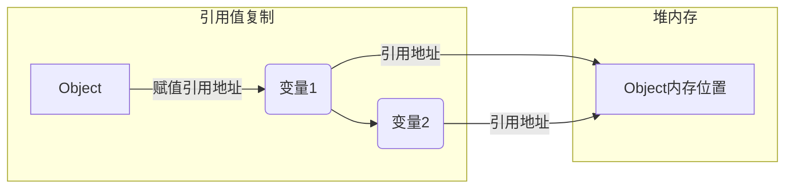
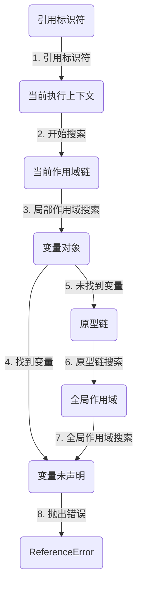

# 变量、作用域与内存

相比于其他语言，JavaScript 中的变量可谓独树一帜。正如 ECMA-262 所规定的，JavaScript 变量是 松散类型的，而且变量不过就是特定时间点一个特定值的名称而已。由于没有规则定义变量必须包含什么数据类型，变量的值和数据类型在脚本生命期内可以改变。这样的变量很有意思，很强大，当然也有不少问题。本章会剖析错综复杂的变量。

## 原始值与引用值

ECMAScript 变量可以包含两种不同类型的数据:原始值和引用值。_原始值(primitive value)_ 就是最简单的数据，_引用值(reference value)_ 则是由多个值构成的对象。

在把一个值赋给变量时，JavaScript 引擎必须确定这个值是原始值还是引用值。在《语言基础》章节了解到7种原始值：`Undefined`、`Null`、`Boolean`、`Number`、`BigInt`、`String` 和 `Symbol`。保存原始值的变量是 _按值(by value)_ 访问的，因为我们操作的就是存储在变量中的实际值。

引用值是保存在内存中的对象。与其他语言不同，JavaScript 不允许直接访问内存位置，因此也就不能直接操作对象所在的内存空间。在操作对象时，实际上操作的是对该对象的引用(reference)而非实际的对象本身。为此，保存引用值的变量是 _按引用(by reference)_ 访问的。

:::note
在很多语言中，字符串是使用对象表示的，因此被认为是引用类型。ECMAScript 打破了这个惯例。
:::

### 动态属性

在JavaScript中，原始值和引用值的行为有很大的不同，尽管它们的定义方式看起来很类似。

原始值是不可变的，即它们的值不能被改变。一旦一个原始值被创建，它的值就不能被改变。原始值不能有属性和方法。即使尝试给原始值添加属性，也不会报错，但这个属性实际上不会存在。

```js
let name = 'Nicholas';
name.age = 27; // 试图给字符串添加属性
console.log(name.age); // undefined
```

引用值是可变的，可以动态添加、修改和删除属性和方法。当你将一个引用值赋值给一个变量时，实际上传递的是对该对象的引用，而不是对象本身。

```js
let person = new Object();
person.name = 'Nicholas';
console.log(person.name); // "Nicholas"
```

注意，原始类型的初始化可以只使用原始字面量形式。如果使用的是 new 关键字，则 JavaScript 会创建一个 Object 类型的实例，但其行为类似原始值。下面来看看这两种初始化方式的差异:

```js
let name1 = 'Nicholas';
let name2 = new String('Matt');

name1.age = 27;
name2.age = 26;

console.log(name1.age); // undefined
console.log(name2.age); // 26

console.log(typeof name1); // string
console.log(typeof name2); // object
```

### 复制值

原始值和引用值在通过变量复制时也有所不同。

原始值在赋值和传递时是值的复制。

想象你有一张纸（原始值），你想要一个副本。所以你用复印机复印了一张。现在，你有两张纸，其中每张纸上的内容都是一样的，但它们是独立的。如果你在其中一张纸上写了新的内容，另一张纸上的内容不会改变。


引用值包括对象、数组和函数。它们在赋值（复制）时实际上复制的是指向内存中实际对象的引用，而不是对象本身的副本。

想象你有一座房子（引用值），这座房子代表在内存中的一个对象。当你把这座房子过户给你的亲人时，他们获得了房子的所有权，也就是说他们可以进入房子、对房子进行装修或改动。即使这个房子焕然一新了，但房子还是最开始的房子。



### 传递参数

ECMAScript 中所有函数的参数都是按值传递的。这意味着函数外的值会被复制到函数内部的参数中，就像从一个变量复制到另一个变量一样。如果是原始值，那么就跟原始值变量的复制一样，如果是引用值，那么就跟引用值变量的复制一样。

对很多开发者来说，这一块可能会不好理解，毕竟变量*原始值按值访问*和*引用值按引用访问*，而传参则只有按值传递。

在按值传递参数时，值会被复制到一个局部变量(即一个命名参数，或者用 ECMAScript 的话说，就是 arguments 对象中的一个槽位)。

_按值传递的含义：_

当你传递一个原始值作为参数时，实际上是将这个值的副本传递给了函数。这意味着函数内部操作的是这个值的副本，而不会影响到原始变量。

```js
function addTen(num) {
  num += 10;
  return num;
}
let count = 20;

let result = addTen(count);
console.log(count); // 20，没有变化
console.log(result); // 30
```

当你传递一个引用值（如对象、数组、函数）作为参数时，实际上是将这个引用值在内存中的地址（指针）传递给了函数。因此，函数内部操作的是这个引用值所指向的对象的实际内容，而不是引用本身。

```js
function setName(obj) {
  obj.name = 'Nicholas';
}

let person = new Object();

setName(person);
console.log(person.name); // "Nicholas"
```

### 确定类型

在《语言基础》章节提到的 `typeof` 操作符最适合用来判断一个变量是否为原始类型。更确切地说，它是判断一个变量是否为字符串、数值、布尔值或 undefined 的最好方式。如果值是对象或 null，那么 typeof 返回"object"。

```js title="示例"
let s = 'Nicholas';
let b = true;
let i = 22;
let u;
let n = null;
let o = new Object();
console.log(typeof s); // string
console.log(typeof i); // number
console.log(typeof b); // boolean
console.log(typeof u); // undefined
console.log(typeof n); // object
console.log(typeof o); // object
```

`typeof` 虽然对原始值很有用，但它对引用值的用处不大。我们通常不关心一个值是不是对象， 而是想知道它是什么类型的对象。为了解决这个问题，ECMAScript 提供了 `instanceof` 操作符。

```js title="instanceof 语法"
result = variable instanceof constructor;
```

如果变量是给定引用类型（由其原型链决定）的实例，则 instanceof 操作符返回 true。

```js
console.log(person instanceof Object); // 变量 person 是 Object 吗?
console.log(colors instanceof Array); // 变量 colors 是 Array 吗?
console.log(pattern instanceof RegExp); // 变量 pattern 是 RegExp 吗?
```

按照定义，所有引用值都是 Object 的实例，因此通过 `instanceof` 操作符检测任何引用值和 Object 构造函数都会返回 true。类似地，如果用 `instanceof` 检测原始值，则始终会返回 false，因为原始值不是对象。

:::info 扩展
`typeof` 操作符对于函数，在所有符合 ECMAScript 标准的浏览器中都应该返回 "function"。对于正则表达式，由于标准中未明确规定其 `typeof` 返回值，因此不同浏览器可能会有不同的行为。早期版本的 Safari 和 Chrome 可能会返回 "function"，而其他浏览器可能会返回 "object"。
:::

## 执行上下文与作用域

执行上下文（Execution Context）和作用域（Scope）是理解 JavaScript 中变量、函数调用和作用域链的核心概念。让我们逐步深入讲解它们的含义和关系。

### 执行上下文

执行上下文是 JavaScript 中代码执行的环境的抽象概念，每当 JavaScript 代码运行时，都会创建执行上下文。执行上下文可以理解为包含了当前代码执行所需的所有信息，包括变量的值、函数的引用、调用栈信息等。

#### 类型

JavaScript 中有三种执行上下文类型：

- [ ] 全局执行上下文（Global Execution Context）：

* 在代码执行之前，全局执行上下文会被创建。它是默认的、最外层的执行上下文，整个 JavaScript 程序运行期间只有一个全局执行上下文。
* 全局执行上下文中定义的变量和函数可以被程序的任何部分访问，它们属于全局作用域。

- [ ] 函数执行上下文（Function Execution Context）：

* 每当一个函数被调用时，都会创建一个新的函数执行上下文。每个函数都有自己的执行上下文。
* 函数执行上下文中包含了函数的局部变量、函数的参数以及函数在调用栈中的位置。

- [ ] Eval 执行上下文：

* 使用 `eval()` 函数执行的代码会在自己的执行上下文中运行。

#### 执行上下文的生命周期

执行上下文的生命周期包括两个阶段：

1. 创建阶段：创建阶段发生在代码执行之前。此阶段包括创建变量对象、确定作用域链、设置 `this` 值等。
2. 执行阶段：创建完成后，执行上下文进入执行阶段，执行代码并处理变量赋值、函数引用等操作。

### 作用域

作用域是指在程序中定义变量的区域，它规定了变量的可访问性和生命周期。JavaScript 中有以下两种主要的作用域类型：

- [ ] 全局作用域（Global Scope）

全局作用域中定义的变量和函数可以在整个程序中访问，它们在全局执行上下文中创建。

- [ ] 局部作用域（Local Scope）

局部作用域只在特定的代码段内部有效，如函数内部。每当函数被调用时，都会创建一个新的局部作用域。

在 ES6 之前，JavaScript 只有全局作用域和函数作用域（通过函数创建），ES6 引入了块级作用域（通过 `let` 和 `const` 关键字），使得 `if`、`for` 等语句块也可以创建作用域。

### 作用域链

作用域链是在 JavaScript 中实现词法作用域的一种机制，它用于解析变量和函数的访问权限。作用域链的构建依赖于函数的嵌套关系。

#### 词法作用域

JavaScript 使用词法作用域（也称为静态作用域），也就是变量的作用域在函数定义时就确定了，而不是在函数调用时确定。

#### 作用域链的形成

每当函数被创建时，会保存其父级作用域的引用。在函数执行时，如果访问一个变量，会先在当前函数的作用域中查找，如果找不到，则向上级作用域链继续查找，直到找到变量或到全局作用域。

这种嵌套的作用域链关系决定了函数可以访问哪些变量和函数。

#### 作用域链增强

虽然执行上下文主要有全局上下文和函数上下文两种(`eval()`调用内部存在第三种上下文)，但有 其他方式来增强作用域链。某些语句会导致在作用域链前端临时添加一个上下文，这个上下文在代码执 行后会被删除。通常在两种情况下会出现这个现象，即代码执行到下面任意一种情况时:

- `try/catch` 语句的 `catch` 块
- `with` 语句

这两种情况下，都会在作用域链前端添加一个变量对象。对 `catch` 语句而言，则会创建一个新的变量对象，这个变量对象会包含要抛出的错误对象的声明。对 `with` 语句来说，会向作用域链前端添加指定的对象。

```js title="示例"
try {
} catch (error) {
  console.log(error); // 错误对象
}

function buildUrl() {
  let qs = '?debug=true';
  with (location) {
    let url = href + qs;
  }
  return url;
}

// error
console.log(buildUrl()); // ReferenceError: url is not defined
```

当 `with` 语句中的代码引用变量 href 时，实际上引用的是 location.href，也就是自己变量对象的属性。

而在 `with` 语句中使用 `var` 声明的变量 url 会成为函数上下文的一部分，可以作为函数的值被返回；但像这里使用 `let` 声明的变量 url，因为被限制在块级作用域，所以下一行报错了。

### 变量声明

ES6 之后，JavaScript 的变量声明经历了翻天覆地的变化。直到 ECMAScript 5.1，`var` 都是声明变量 的唯一关键字。ES6 不仅增加了 `let` 和 `const` 两个关键字，而且还让这两个关键字压倒性地超越 `var` 成为首选。

#### 使用 var 的函数作用域声明

在使用 `var` 声明变量时，变量会被自动添加到最接近的上下文。在函数中，最接近的上下文就是函数的局部上下文。在 `with` 语句中，最接近的上下文也是函数上下文。如果变量未经声明就被初始化了， 那么它就会自动被添加到全局上下文。

```js
function message() {
  var name = 'MoFan';
  age = 18;
}

message();

console.log(name); // undefined
console.log(age); // 18
```

:::danger
在严格模式下，未经声明就初始化变量会报错。
:::

`var` 声明会被拿到函数或全局作用域的顶部，位于作用域中所有代码之前。这个现象叫作“提升” (hoisting)。提升让同一作用域中的代码不必考虑变量是否已经声明就可以直接使用。可是在实践中，提
升也会导致合法却奇怪的现象，即在变量声明之前使用变量。

```js title="全局作用域中两段等价的代码示例"
var name = 'Jake';
// 上下等价于:
name = 'Jake';
var name; // Jake

// 下面是两个等价的函数:
function fn1() {
  var name = 'Jake';
}
// 等价于:
function fn2() {
  name = 'Jake';
  var name;
}
```

通过在声明之前打印变量，可以验证变量会被提升。声明的提升意味着会输出 undefined 而不是 Reference Error:

```js
console.log(name); // undefined
var name = 'Jake';

function fn() {
  console.log(name); // undefined
  var name = 'Jake';
}
```

#### 使用 let 的块级作用域声明

ES6 新增的 `let` 关键字跟 `var` 很相似，但它的作用域是块级的，这也是 JavaScript 中的新概念。块级作用域由最近的一对包含花括号 `{}` 界定。换句话说，`if` 块、`while` 块，甚至连单独 `{}` 的块也是 `let` 声明变量的作用域。

```js
if (true) {
  let a;
  console.log(a); // ReferenceError: a 没有定义
}

while (true) {
  let b;
}
console.log(b); // ReferenceError: b 没有定义

{
  let d;
}
console.log(d); // ReferenceError: d 没有定义
```

`let` 与 `var` 的另一个不同之处是在同一作用域内不能声明两次。重复的 `var` 声明会被忽略，而重复的 `let` 声明会抛出 SyntaxError。

```js
var a;
var a;
// 不会报错

{
  let b;
  let b;
}
// SyntaxError: 标识符 b 已经声明过了
```

严格来讲，`let` 在 JavaScript 运行时中也会被提升，但由于[暂时性死区](/language-basics/#暂时性死区)(temporal dead zone)的缘故，实际上不能在声明之前使用 `let` 变量。因此，从写 JavaScript 代码的角度说，`let` 的提升跟 `var` 是不一样的。

#### 使用 const 的常量声明

除了 `let`，ES6 同时还增加了 `const` 关键字。使用 `const` 声明的变量必须同时初始化为某个值。 一经声明，在其生命周期的任何时候都不能再重新赋予新值。

```js
const a; // SyntaxError: 常量声明时没有初始化
const b = 3;

console.log(b); // 3
b = 4; // TypeError: 给常量赋值
```

`const` 除了要遵循以上规则，其他方面与 `let` 声明是一样的。

`const` 声明只应用到顶级原语或者对象。换句话说，赋值为对象的 `const` 变量不能再被重新赋值为其他引用值，但对象的键则不受限制。

```js
const o1 = {};
o1 = {}; // TypeError: 给常量赋值

const o2 = {};
o2.name = 'Jake';
console.log(o2.name); // 'Jake'
```

如果想让整个对象都不能修改，可以使用 `Object.freeze()`，这样再给属性赋值时虽然不会报错，但会静默失败:

```js
const o3 = Object.freeze({});
o3.name = 'Jake';
console.log(o3.name); // undefined
```

由于 `const` 声明暗示变量的值是单一类型且不可修改，JavaScript 运行时编译器可以将其所有实例都替换成实际的值，而不会通过查询表进行变量查找。谷歌的 V8 引擎就执行这种优化。

:::info 最佳实践
开发实践表明，如果开发流程并不会因此而受很大影响，就应该尽可能地多使用 const 声明，除非确实需要一个将来会重新赋值的变量。这样可以从根本上保证提前发现 重新赋值导致的 bug。
:::

#### 标识符查找

当在特定上下文中为读取或写入而引用一个标识符时，必须通过搜索确定这个标识符表示什么。搜索开始于作用域链前端，以给定的名称搜索对应的标识符。如果在局部上下文中找到该标识符，则搜索停止，变量确定;如果没有找到变量名，则继续沿作用域链搜索。(注意，作用域链中的对象也有一个原型链，因此搜索可能涉及每个对象的原型链)。这个过程一直持续到搜索至全局上下文的变量对象。 如果仍然没有找到标识符，则说明其未声明。



:::note 了解
标识符查找并非没有代价。访问局部变量比访问全局变量要快，因为不用切换作用域。不过，JavaScript 引擎在优化标识符查找上做了很多工作，将来这个差异可能就微不足道了。
:::

## 垃圾回收
